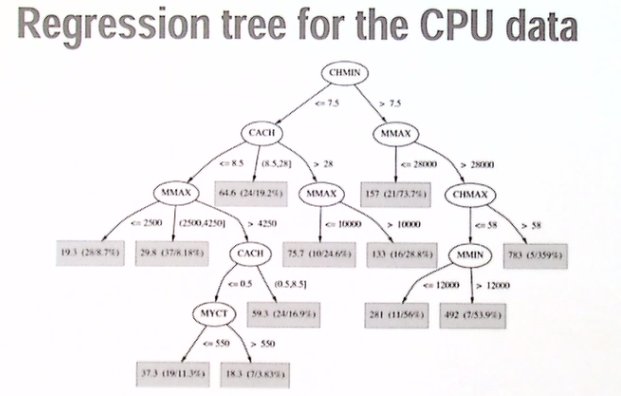
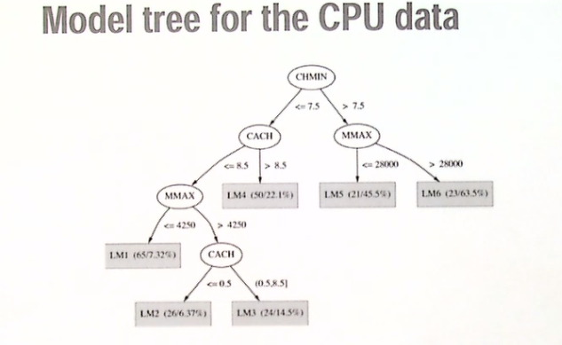
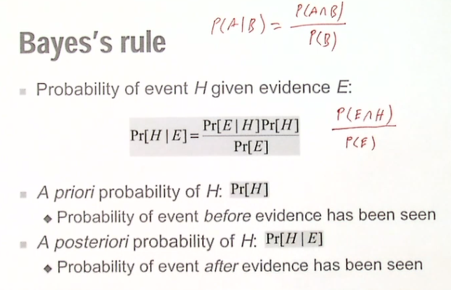

- Chapter 9 in book "Introduction to Weka Tool"

# Explanation of ARFF Format
The arff format can be used to collate the data. 
`%` is used as comments. `@` can be used to define attributes and thier types. An example of an .arff file is as follows:

`
    % 1. Title: Iris Plants Database
    % 
    % 2. Sources:
    %      (a) Creator: R.A. Fisher
    %      (b) Donor: Michael Marshall (MARSHALL%PLU@io.arc.nasa.gov)
    %      (c) Date: July, 1988
    % 
    @RELATION iris

    @ATTRIBUTE sepallength  NUMERIC
    @ATTRIBUTE sepalwidth   NUMERIC
    @ATTRIBUTE petallength  NUMERIC
    @ATTRIBUTE petalwidth   NUMERIC
    @ATTRIBUTE class        {Iris-setosa,Iris-versicolor,Iris-virginica}
`
# Collecting the Data

## Missing Values

Missing values could create malfunctioning algorithms. when there is an missing value we can sometimes use algorithms to "guess" what the value would be. 

## Inaccurate Values

More dangerous than missing values, but there are ways to cleanse the data and make sure it is accurate.

## Getting to know the Data

Always investigate the data and confirm that you understand the data fully. Any assumptions on the attributes could have bad consequences.

## Representing Strutural Patterns

Building a tree to represent the knowledge in the data. 

## Decision Trees

Divide and conquer approach that models the attributes as a logical flow. Starting at the root all the instances are split into classes that are homogenous.

## Nominal and numeric attributes

Knowing the value we can create a conditional branch based on known classification rules. typically a nominal value could be broken down as either yes or no, and numerical values can be branched by values.

## Classification rules

When building the classification tree models the algorithms split based on different ways.Such as anding , or'ing or others. 
- Antecedent, Consequent, etc. 
The rules are necessary to sort and classify data quickly to find subsets. 

## From rules to trees

From rules to trees are much easier than using a tree to define the rules. 

## Trees for numeric prediction

Regression tree : decision tree where each lead predicts a numeric quantity. Predicted value is average value of training instances that reach the leaf.
Model Tree : regression tree with linear regression models at the leaf nodes. linear patches approximate continuos function
Splitting the data into decision tree with few leaf nodes. Then create linear regression model for each leaf node. Model then gets new values that are rant hrough the decision tree and into the linear regression models.

## Instanced-Based representation

Instance Based Learning,Analogy based, Case based Reasoning (CBR). 
This looks at each instance then compares it with others. The instance has features that you can look up to find similar instances. for example retrieving similar law enforcement cases based on one. We then calculate a similarity measure. One example for similarity measure could be euclidean distance.

Methods : nearest-nieghbor, k-nearest nieghbor..

# Assignment 1 - Linear regression for the CPU data

Numeric prediction for the regression model.

PRP = -56.1 + 0.049 MYCT + 0.015 MMIN + 0.006 MMAX + 0.630 CACH - 0.270 CHMIN + 1.46 CHMAX

https://machinelearningmastery.com/use-regression-machine-learning-algorithms-weka/

# Modeling

## 1R Modeling

## Statistical modeling

Classification models like naive-bayes
are probabalistic type of models that uses statistics to evaluate all the attributes.

1. Turn the numerical data in porportionality based on all the other nuemerical data.
2. knowing the classifications we can predict using independent attributes as probabilities by multiplying each porportion and get a total likelyhood. 

> Note : likelyhood is not probability. you must use the probability(x) = likelihood(x) /likelihood(x) + likelihood(y).

# Bayes Rule

Tells us how we should modify the strength of our belief in a particular hypothesis after we have learned a new bit of evidence.

General Rule for "Conditional probability"

`P(A/B) = P(A and B) / P(B)`

- A priori probability of H: probabilit of event before evidence has been seen
- A posteriori probability of H: probability of event after evidence has been seen

Probability of event H given evidence E:

# Regression Machine Learning in Weka

Regression algorithms supported by Weka :

1. Linear Regression
2. k-Nearest Neighbors
3. Decision Tree
4. Support Vector Machines
5. Multi-Layer Perceptron

## How to measure the performance

The performance can be graded by using te cross validation on the same datapoints.

* Correlation Coefficient
    - a number between −1 and +1 calculated so as to represent the linear dependence of two variables or sets of data.
* Mean Absolute Error
    - a measure of difference between two continuous variables
* Root Mean Squared Deviation Error
    - represents the sample standard deviation of the differences between predicted values and observed values.
     each error influences MAE in direct proportion to the absolute value of the error, which is not the case for RMSD.
* Relative Absolute Error
    - The relative error is the absolute error divided by the magnitude of the exact value.
* Root Relative Squared Error
    - the relative squared error takes the total squared error and normalizes it by dividing by the total squared error of the simple predictor. By taking the square root of the relative squared error one reduces the error to the same dimensions as the quantity being predicted.

## Linear Regression

Linear regression works by estimating coefficients for a line or hyperplane that best fits the training data. Is is a very simple regression algorithm. It works best if the output variable of the data is a linear combination of the inputs.

### When not to use?

When the data has input attributes that are highly correlated. We can eliminate correlated input attributes automatically by setting the "eliminateColinearAttributes" to true.

Attributes that are unrelated to the output variable can also negatively impact performance. The weka tool could also only select relevant attributes by setting the 'attributeSelectionMethod`, (enabled by default).
