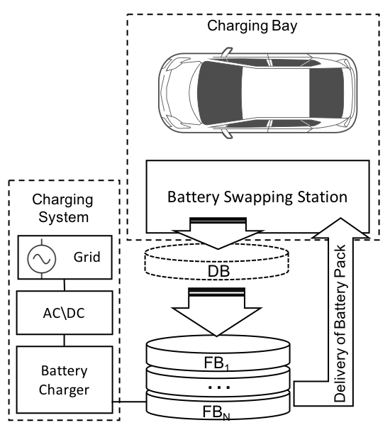
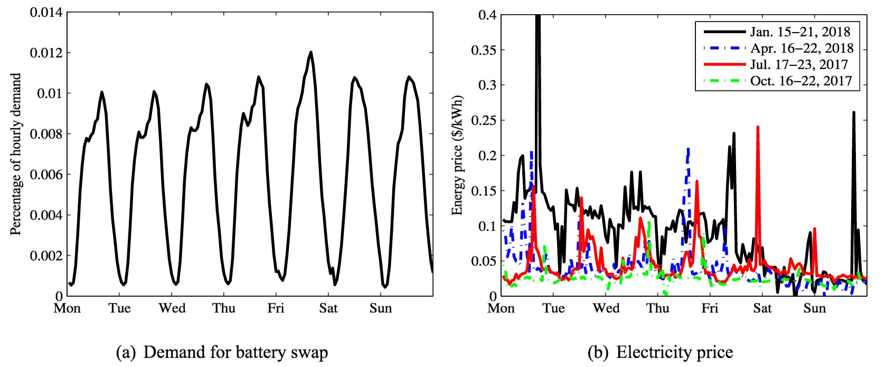
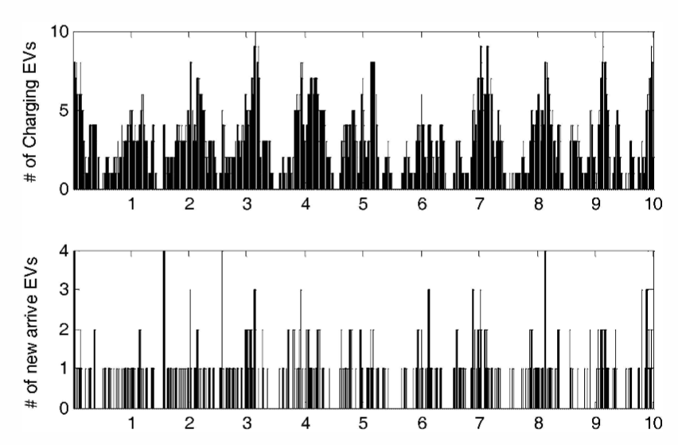
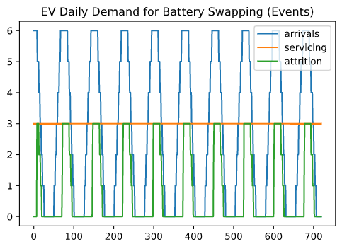

# Battery Swapping Station Simulation and Analysis

## Introduction

This article proposes the battery swapping technology as a viable system bieng adopted by manufacturers to replace EV charging stations. The control's around managing a system like this would require a multivariate optimization. Before diving into an algorithmic approach the author attempts to understand the background of a typical battery swapping station and designs an object oriented simulation in python programming language to simulate the operation of some number of EV's serviced by *N* number of bays. 

A strategy to simulate the demand curve for arriving EV's is inffered through reference litterature providing a typical charging demand curve in NYC, New York, United States. 

The variables to adjust the simulation emerge from various design decisions and considerations of human behviour when engaging with a battery swapping station (BSS).


## Background
### Battery Swapping as a Charging Alternative
An alternative to recharging is to exchange drained or nearly drained batteries (or battery range extender modules) with fully charged batteries. This is called battery swapping and is done in exchange stations.

### Battery Swapping Market
The consumer is no longer concerned with battery capital cost, life cycle, technology, maintenance, or warranty issues; Swapping is far faster than charging: battery swap equipment built by the firm 'Better Place' has demonstrated automated swaps in less than 60 seconds; Swap stations increase the feasibility of distributed energy storage via the electric grid;
### Battery Swapping Challenges
Potential for fraud (battery quality can only be measured over a full discharge cycle; battery lifetime can only be measured over repeated discharge cycles; those in the swap transaction cannot know if they are getting a worn or reduced effectiveness battery; battery quality degrades slowly over time, so worn batteries will be gradually forced into the system). Manufacturers' unwillingness to standardize battery access / implementation details extend from EV chargers into the BSS technologies. The various methods to charge the EV defined by the IEC standard are slowly adopted by the manufactures. These standards also change as the technology continues to improve. 



*Fig. 1. Illustration of Battery Swapping Station, 'FB' is Full Battery and 'DB' is Dead Battery.*

By creating a simulator in python programming language the cardinality of the problem can be seen. The variation of variables as the design is constructed is exposed under the scrutiny of implementing a simple system of cars arriving and cars bieng serviced in charging bays. 

The software simulation could be broken down into three major classes that encapsulate the behavior in instantiated methods. Another key feature of the object oriented classes for the components of the design ( EV, Charging Bay, and Lobby) allow for the dynamic length of each of these components to assist in simulating the effeciency at different scales.

### Assumptions

- Fully charged battery at the beginning of the day
- How many batteries are needed for a given demand?
- Capacity of each battery not considered
- No specific type of the battery
- No repair costs
- Infinite repair capacity
- Demand is predefined and simulated 
- Timescale is in minutes-hours (720 mins)
- EV's will have a timeout when waiting in line to be serviced


## Simulating Demand for Battery Swapping


*Fig. 2. Illustrating the battery-swapping demand and the energy price.*

> Fig 2(a )illustrates the percentage of the average hourly refuel-ing  demand of vehicles at gasoline stations overone week.Fig.2(b)shows the energy prices of New York City in Jul.17–23,2017,Oct.17–23,2017,Jan.15–21,2018,andApr.16–22,2018.

An excerpt from [2] 
    The daily travel patterns a real so likely to exhibit periodicity based on the National Household Travel Survey in 2009.1 The electricity price also exhibits strong daily and weekly periodicity and can often be accurately forecasted , according to Amjady and Keynia(2009).Accordingly,we take the demand rate and the electricity price to be jointly periodic functions in the present study.

The afor-mentioned referenced periodic demand curve given n percentage of hourly demand for battery swapping could be simulated using a sinusoidal function that peaks at mid-day on a daily period. Even further we can reference the behaviour of EV's charging in Austin Texas to simulate the time EV's would need to charge,andin this case request a battery swap through out the day. Fig. 3 shows the demand of charging to roughly peak every hour with on average 5 EV's at those peaks.


*Fig. 3. Observation of EV charging behaviour.*

### BSS Simulation

EV class : When instantiated has an ID to keep track of it, and a timeout parameter. The timeout parameter is used to determine when the EV "leaves" because it has waited to be serviced for too long.

```python
class EV(object):
    def __init__(self,ID, timeout):
        self.ID = ID
        self.timeout = timeouta   o
        self.wait_time = 0
    #...
    # wait()
```

Lobby class : Only instantiated once but holds a list of EV class objects like a queue. A methods like 'enter','leave' and 'get_next' provide access to the EV list by appending, removing or getting the next in the queue.

```python
class Lobby(object):
    def __init__(self):
        self.EVs = []
    # ...
    # enter()
    # leave()
    # get_next()
    # update()
```

Bay class : Instantiated for as many bays are needed. The number of bays would be a configurable value based on cost analysis compared to the demand. The bay allows for an EV object to enter the bay and remain in the bay for a period of time 'swap_delay' until the battery swap can be completed. The EV will then be returned once complete. Only bays with a 'is_empty' parameter will be given an EV to service.

```python
class Bay(object):
    def __init__(self,ID,swap_delay):
        self.ID = ID
        self.swap_delay = swap_delay
        self.timer = 0
        self.EV=None
    # ...
    # enter()
    # leave()
    # is_empty()
    # update()
```


### Results

The parameters provided to the simulator where tha there are 3 battery swapping bays, to service demand over half a day (720 minutes) . The demand curve is a sinusoidal that imitates the reference documentation in [1] as shown in Fig. 2.  


*Fig. 4. Observation of Simulator showing EV serviced at swapping stations.*


# Reference

[1] BoSuna, XuSunb, DannyH.K.Tsanga, WardWhitt; "Optimal battery purchasing and charging strategy at electric vehicle battery swapstations"


[2] Frank Schneider,aUlrich W. Thonemann,aDiego Klabjanb;Optimization of Battery Charging and Purchasing atElectric Vehicle Battery Swap Stations,  Supply Chain Management and Management Science, University of Cologne, 50931

[3] "ev battery swapping is dead in us but china wants to make it happen, "https://electrek.co/2020/01/17ev-battery-swapping-is-dead-in-us-but-china-wants-to-make-it-happen/


[4] Xiaochen Zhang,Santiago Grija1va
; An Advanced Data Driven Model for Residential Electric Vehicle Charging Demand

[5] https://en.wikipedia.org/wiki/Charging_station#Battery_swapping


(Warning: Internal References Ommitted. To be completed)
