# Intelligent Systems : Final Exam
EEL5935 
Hector Lopez


## Problem #1 [10 Points]
Two fuzzy sets A,B defined on the universe X={0,1,2,3,4,5,6,7,8,9 } as follow:

```
A= {0/0 0.1/1, 0.2/2, 0.6/3, 1/4, 0.5/5, 0.3/6, 0 .2/7, 0.1/8}

B= {0/0 01.2/1, 0.3/2, 0.6/3,1/4, 0.7/5, 0.4/6, 0.3/7, 0.2/8, 0.1/9}
```

Answer the following questions:
    
### (I)Sketch the membership functions of A and B sets
    
Membership Function A:
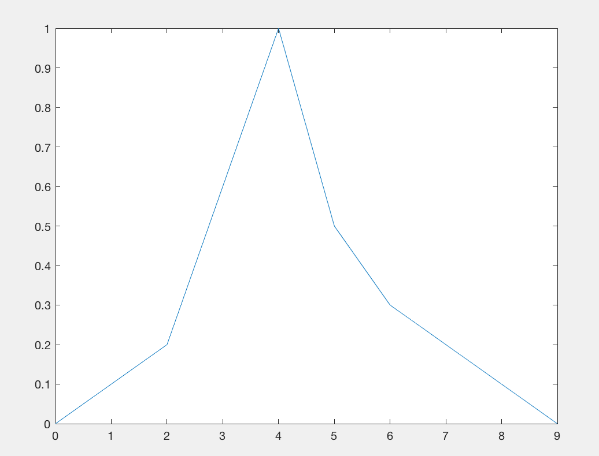

Membership Function B:
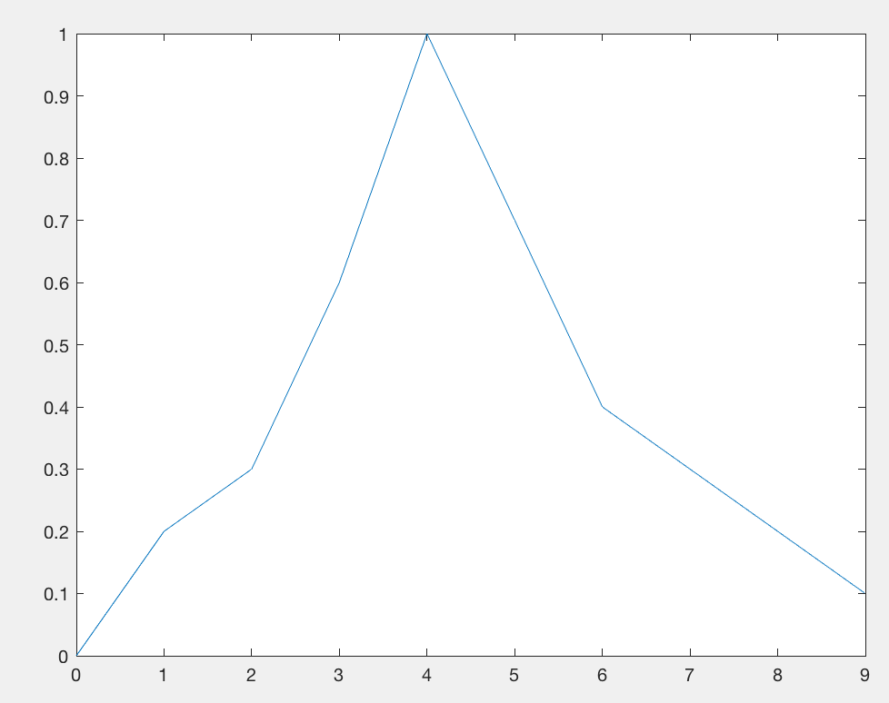


### (ii) Compute and sketch C= (A union B) & D=(A intersection B);
- C = min[u_a, u_b] = {0/0 0.1/1, 0.2/2, 0.6/3, 1/4, 0.5/5, 0.3/6, 0.2/7, 0.1/8, 0/9}

- D = max[u_a, u_b] = {0/0, 0.2/1, 0.3/2, 0.6/3,1/4, 0.7/5, 0.4/6, 0.3/7, 0.2/8, 0.1/9}

### (iii) Is the following relation true/false? Please clarify; A (contained in) B
Yes, because the entire membership function of A can fit within the membership function of B.
Notice the answer(ii) shows that the union of the two sets just takes the maximum of the function that ends up equaling the same as fuzzy set B meaining A is encompassed by, or is contained in B.

---
## Problem #2 [10 points]
Given 3 fuzzy sets

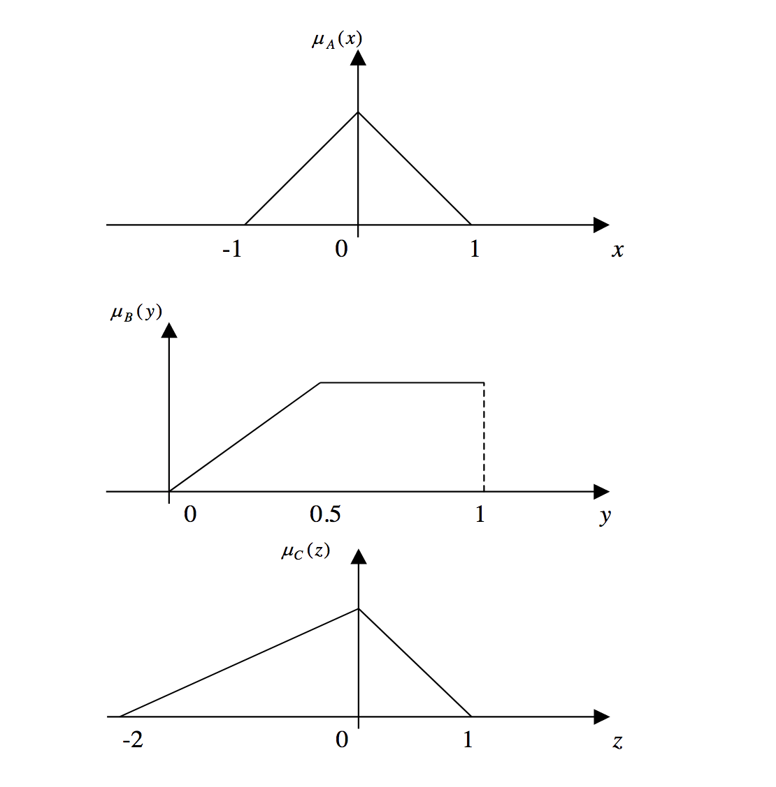

(1)Sketch the graph of  AC; AC, BC, and BC
- TBD

(2)Sketch ABC
- TBD

(3)Sketch ABC
- TBD

---
## Problem #3 [20 Points]
Let’s consider the following fuzzy membership function:

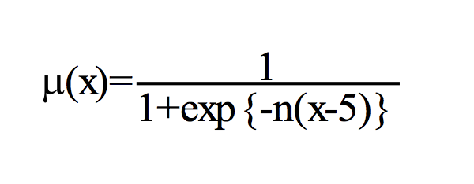

### (i) For n=+2 and n=-2 draw the graphic representation of the membership function.

Where n=+2:
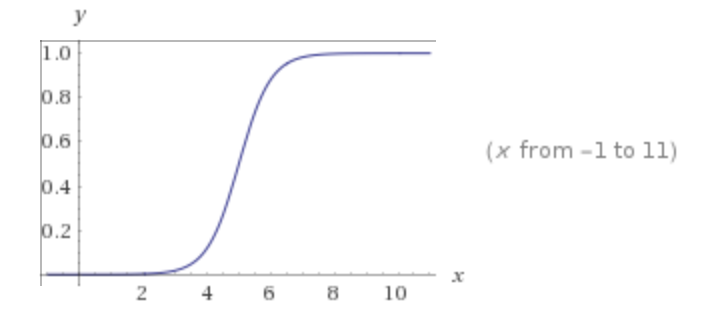

Where n=-2:
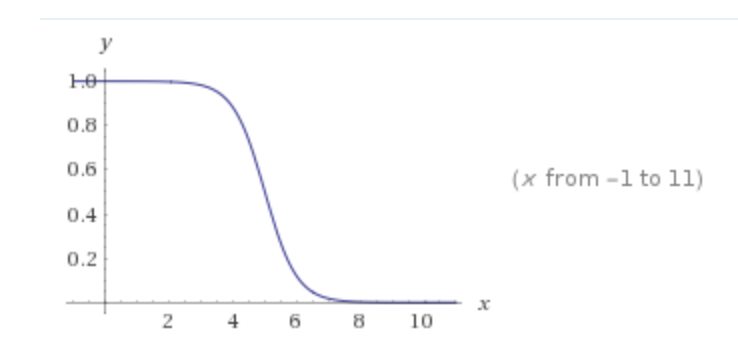

Membership Function :
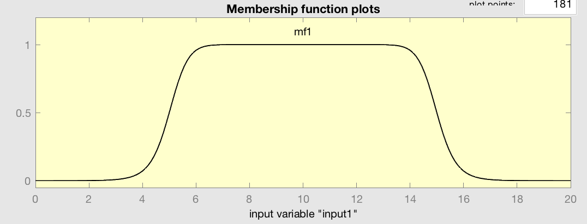


### (ii) What is the shape of the above equation for n=0 and n= inf

The resulting shape would be a point, since the expression when n=0 or infinity becomes a point or undefined.

### (iii) What type of linguistic terms (Low, medium, high) the function represent for either a positive or a negative parameter n.

For a negative and possitive paramater of 'n=2' the function seems to represent a "Low" linguistic variable. When 'n' is between 2 and -2 the value seems to show a value of "high".


---

## Problem #4 [20 Points]

Summarize the paper entitled “Comparison of Fuzzy and Neural Truck Backer-Upper Control
System” by S. K. Kong and B Koscho (Please see attached paper). Specifically address the
following issues:

### (i) Fuzzy and NN controllers structures.

Fuzzy systems use a small number of strutcutred linguistic input-output samples from an expert or from some other adaptive estimator. While nueral systems use a large number of numeric input-output samples from the control process or from some other database. Both approaches are different than the traditional model based approach to control systems. Depending on the type and availability of the sample data will determine when to use fuzzy, neural or modeled controllers. If representative numerical data is available but the structured expertise is not then the nerual approach would be best. A fuzzy system is simple and best used when there is expert knowledge available. In some cases a hybrid approach can be used.

### (ii) Fuzzy control rules and decision making.

The fuzzy control rules are created using expert knowledge of the system. The backer upper system was defined with the fuzzification of the process variables such as angle of the steering wheels, the movement in position and the angle against the loading dock. The linguistic values allowed for the creation of rules that are easy to understand create by an expert. These "Fuzzy Associative Memory" or FAM rules are powerful when creating a controller that makes decisions based on abstracted "IF/THEN" rules. As more rules are made the more precise the controller can be in making decisions. We see further in the paper that the entire rules surface is not needed to provide adequate results by the controller.

### (iii) Performance of FLC and NN and conventional controllers.

The paper reivews the performane of a conventional neural network vs. a fuzzy controller when dealing with a truck that is backing into a loading dock. This is a non-linear problem that resulted in heavy computation for the neural network. Also the ability for hte NN to determine an optimization for the quality of the path was unavialable due to the inherent unsupervised learning the NN undergoes when discovering the optimal path. The NN can fall into local minima that results in sub-optimal solutions give its training data. The fuzzy controller on the other hand benefits from expert knowledge allowing for smoother control and a higher quality of the path chosen by the controller to be optimum. The paper also showes the robustness of the Fuzzy controller when rules where removed from the system. Its path was more unruly but still higher quality than the performance of the neural net, not to mention the Fuzzy controller was a lighter implementation with less computation overhead needed by the large neural net training set.


### (iv)The advantages and disadvantages of the proposed design technique for the system systems

The proposed design technique showed great promise when dealing with this problem of backing a truck into a loading dock. The results of the paper show a robust and high level of quality for the problem using fuzzy controller. The advantage is the lightweight controller implementation and the ability to build a useful model without large amounts of training data needed by the neural net controller. 

---
## Problem # 5 [20 Points] + {5 extra points for simulation}

Consider the controller design for a Central Air Condition System. Suppose you would like to
have a steady room temp. Around 74 F degree. The outside temperature can be varied relative to the room temperature depending upon various seasons and weather conditions. The ranges of
changes include “very cold”, “cold”, “medium”, “hot” and “very hot” temperature.

### (i) Design a Fuzzy Logic Controller (FLC) for this system.

Fuzzify the linguistic values:
```
outside_temp :  {"very cold","cold","medium","hot","very hot" }

room_temp : {"cold","good","hot"}

command_vars : {"heat", "off", "cool" }
```

Design the controller and membership functions:
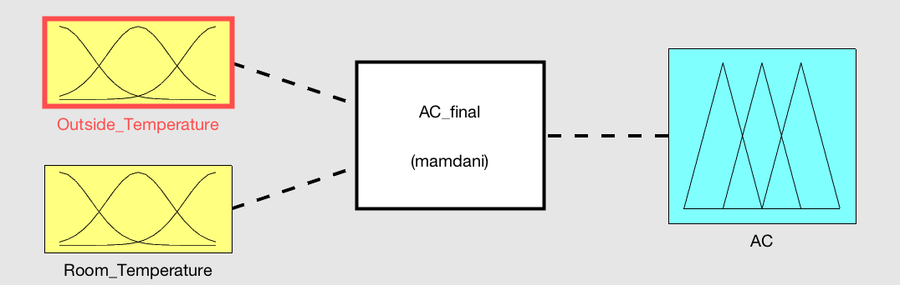
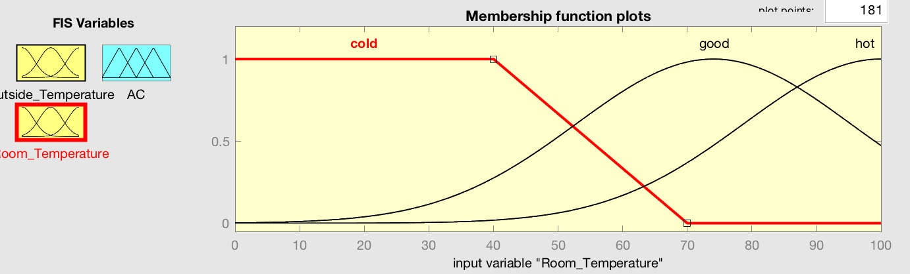
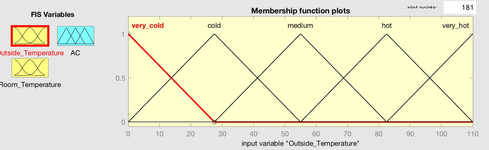
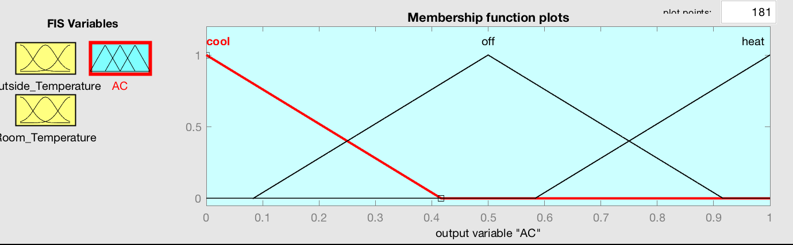

Create rules and decision surface:
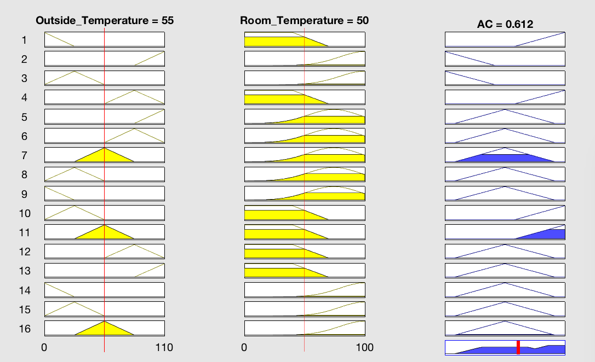
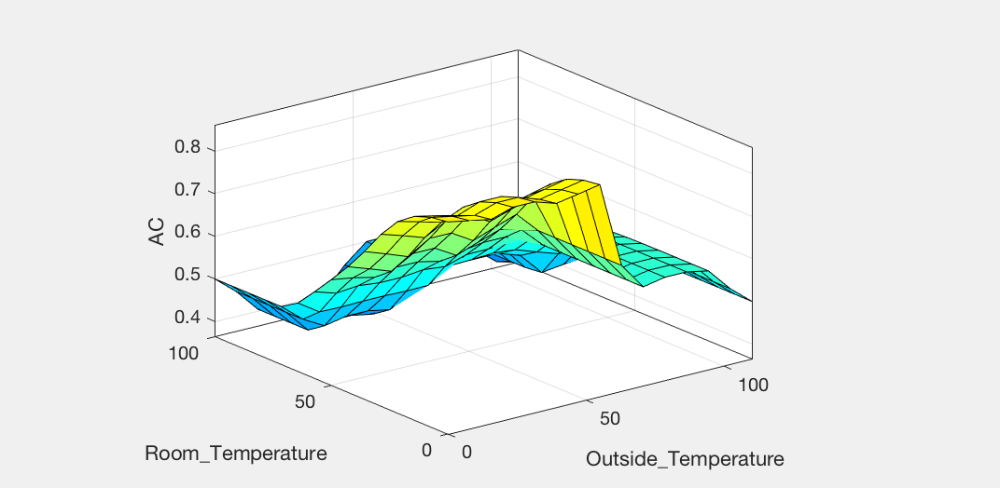


### (ii) Draw the major block diagrams for the process as well as FLC.

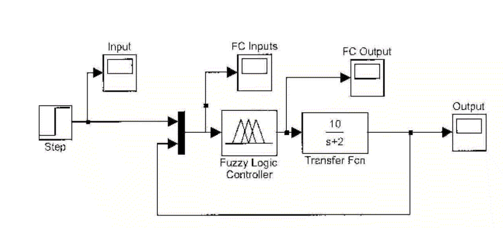

Adding the transfer function and creating a highlevel diagram :

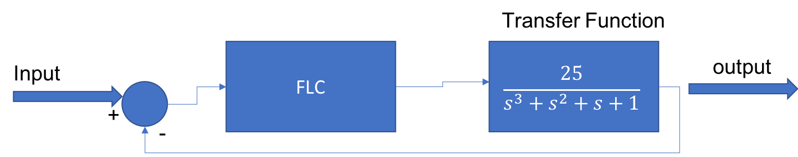


### (iii) Show step by step your FLC design.

1. Input (vocabulary fuzzification)
    - Create linguistic variables for the outside and room temperature. 
2. Fuzzy Propositions 
    - when the outside temp is cold and the room temp is cold then heat the room
    - when the outside temp is hot and the room is hot then cool the room
    - when the outside temp is cold and the room is hot then leave ac off. (this gives time for the room to cool given the outside temp.)
3. Hedges
    - The temperatures are hedged give the average room temp bieng 74 degrees. anything higher than that by 10 degs. would be hot and above that it would be very hot. 
    - Temperatures similarly beloe 10 degrees is considered cold then very cold. 

---

## Problem #6 [20 Points]+ {10 extra points for simulations}
Consider a System with the following transfer function of a plant

(i) What are the poles and zeros of open loop systems?

```
 H= tf([25],[1 8 25 0])

H =
 
          25
  ------------------
  s^3 + 8 s^2 + 25 s
 
Continuous-time transfer function.

>> pole(H)

ans =

   0.0000 + 0.0000i
  -4.0000 + 3.0000i
  -4.0000 - 3.0000i

>> tzero(H)

ans =

  0×1 empty double column vector
```

### (ii) Design a fuzzy controller for a closed -loop system.
- TBD

### (iii)Please provide step by step implementation procedures for the controller design.Justifyyour answer.

1. Input (vocabulary fuzzification)
2. Fuzzy Propositions 
3. Hedges
4. Combination and Evaluation
5. Action- Deffuzification

### (iv) Simulate thesystem using Simulink and Fuzzy toolbox(5 point extra).
- TBD

### (v) For two various inputs (e.g. Step inputs and sinusoidal) simulate your design(5 point extra).
- TBD
