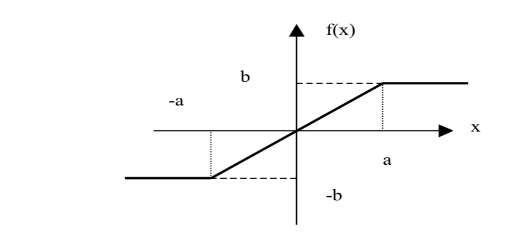

# Intelligent Systems : Homework 1

EEL5934 SUMMER 2019;
Hector Lopez


## 1. Considering the sigmoid function

```
1/(1 + e^(-a x))
```

### (a) What are the upper and lower limit of the function for constant 'a', and the value of f(x) at x=0 ?

If alpha is constant then the sigmoid function is only constrained as it reaches -/+ infinity . By looking at the limit of x as it reaches negative infinity we see the value of the function go to 0.
```
lim_(x->-∞) 1/(1 + e^(-ax)) = 0
```
As x goes to positive infinity the value of the sigmoid function becomes 1.
```
lim_(x->∞) 1/(1 + e^(-ax)) = 1
```
As we inspect the when the value of x=0 the exponential product becomes 0 and forces e^0 , which is equal to 1. the denominator becomes 2 and eventually collapses the sigmoid function to equal exactly 0.5 when x=0.

### (b) Can you show that df/dx is given by the following ?
```
df/dx = a * f(x)[1-f(x)]
```

To prove the statement we start by taking the derivative of the sigmoid function.
```
d/(dx)(1/(1 + e^(-a x))) = e^(-ax) / (1+e^(-ax))^2 
```
We can expand the denominator out into two terms and multiply the numerator by 1. 

```
[1/(1+e^(-ax))] * [e^(-ax)/ (1+e^(-ax))]
```
Since 1-1 =0  we can add '0' to the numerator in the form of a 1 and a -1 term and transform the second term
```
[1/(1+e^(-ax))] * [1 - (1+e^(-ax))]
```
Substituing f(x) for 1/(1+e^(-ax)) we can finally see that the derivative can take the form of the following :

```
f(x) * [1 - f(x)]
```

### (c) How would you modify f(x) such that its value at x=0 is equal  (i) 0.15; (ii)0.8

We can rewrite the sigmoid function with a term 'b' that modifies the denominator to adjust its y value at x=0

```
y = 1/(1 + e^(-a * x +  a * b))
```

To attain the values in consideration we can attain the desired value for 'y' by plugging in 'y' and identifying the value for 'b' , we can choose  'a=1'

```
0.15 = 1/(1 + e^(-x +  b))

b = -log(17/3)/(x - 1)
```

similarly ;

```
0.8 = 1/(1 + e^(-x +  b))

b = x - 2*log(2)
```

### (d) What is the value of f’(x) at the origin? 

Uing matlab we solve for when x =0 to get the value of y.
y = 0.25.


## 2.   Consider the activation function f(x) shown below:



### (a) Formulate f(x) as a function of x 
A quick interpretation would be a peacewie function using the slope of the line with an intercept assumption of x=0.
```
f(x) =   b/a ; -a < x < a
         b   ; x >= a
        -b   ; x <= -a
```

### (b) Obtain f(x) if  either a or b or both are allowed to approach zero. 


If we take the function as a approaches 0 we can immediately see an undefined state at x=0, showing that the function will break down near the origin, or become a infinite step function. but the value for every input x will either be -b or b if a negative or positive.

```
f(x) as a -> 0

f(x) =   b/0 ~ (undefined); -0 < x < 0 
         b   ; x >= 0
        -b   ; x <= -0

(true step function equivalent)

```

As we take b going to 0 we can see a squashing behaviour where all values of x will result in 0.
```
f(x) as b -> 0

f(x) =   0/a ~ (0); -0 < x < 0 
         0   ; x >= a
        -0   ; x <= -a

(line with 0 slope and 0 intercept)
```

A both values go to zero, then the function defines all vlaue the same way as before all values of x will result in 0 except for x=0 becomes undefined.

```
f(x) as b -> 0 &  as a -> 0

f(x) =   0/0 ~ (undefined) ; -0 < x < 0 
         0   ; x >= 0
        -0   ; x <= -0

(line with 0 slope and 0 intercept)
```

