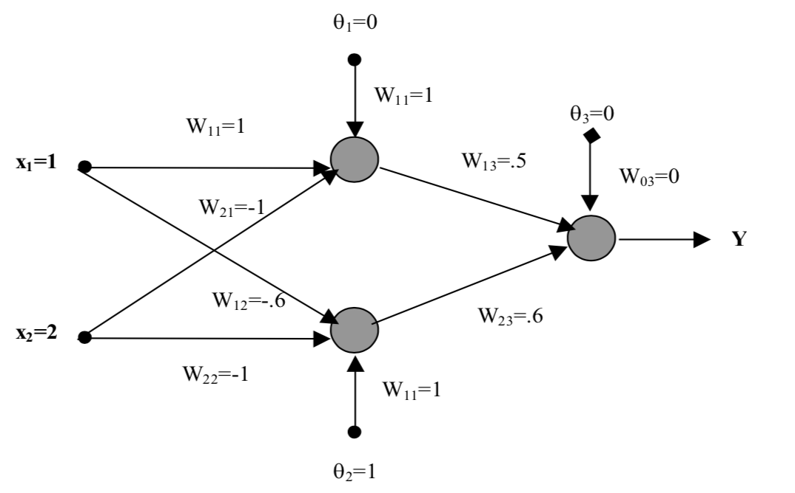
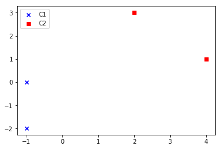
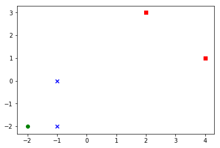

# Intelligent Systems : Homework 2

EEL5934 SUMMER 2019;
Hector Lopez

## 1. Consider the following network; Obtain the output Y for the following cases:  





Before we can represent the output Y, lets break down the formula for each neuron in our first layer. Given that the input must be multiplied by the weights and then summed we can use matrix notation to represent this operation and pass it to an activation function we will call 'F(x)' for now.


```
Given the input X = [1;2] we find output of each neuron as  :
Output = activate( w*X + b) ; where w = weights, b = bias

Find a1,a2 as output of hidden layer

a1 = activate([1 -1] * [1;2] + 0 )

a2 = activate([-0.6 -1] * [1;2] + 1)

Use hidden layer output as input to final layer neuron

Y = activate([0.5 0.6]* [a1;a2] + 0)

```

### (a) All the neurons are represented by a linear function with slope of 1 (y=x) 

With a linear activation function we can just utilize the input as the output. The formula will just pass along the value without bieng squashed.

```matlab
a1 = [1 -1] * [1;2] + 0 ;
a2 =[-0.6 -1] * [1;2] + 1;
Y = [0.5 0.6]* [a1;a2] + 0

Y =

   -1.4600
```

### (b) All the neurons are represented by a McCulloch-Pitts model (hard limit activation function with negative threshold zero)

With a hard limit activation function we need to limit the output to be at least 0. The formula will just pass along the value without bieng squashed if its greater than 0 .

```matlab
a1 = [1 -1] * [1;2] + 0 ;
if(a1<0) a1=0; end

a2 =[-0.6 -1] * [1;2] + 1;
if(a2<0) a2=0; end

Y = [0.5 0.6]* [a1;a2] + 0
if(Y<0) Y=0; end

Y =

   0
```


### (c) All the neurons are represented based on a sigmoid activation function.  

A sigmoid function will squash the output to be between -1 and 1. To accomplish this we can use the same pattern to apply a function to the output of each neuron and then on our last neuron.

```matlab

a1 = [1 -1] * [1;2] + 0 ;
a1 = (1/(1+exp(-a1)));

a2 =[-0.6 -1] * [1;2] + 1;
a2= (1/(1+exp(-a2)));

Y = [0.5 0.6]* [a1;a2] + 0;
Y =  (1/(1+exp(-Y)));

Y =

    0.5585

```

## 2.   Suppose you would like to implement the following logic gates using NN .for each case, could you  utilize  one (or two) hidden  layer(s) with linear activation function to achieve your goal?  If your answer is yes, justify your answer. If your answer is no, suggest an alternative solution. 

### (a) OR gate & (b) AND gate 
    The OR and th AND gate can be modled ith a linear activation function with a single layer since they are linearly seprable functions. If we map the decision surface e can find a vector that can linearly seperate the inputs.

### (c) XOR gate
    The XOR gate's decision surface cannot be classified linearly like the OR and the AND gate, so we cannot use a linear activation. We can use a Multiple ADALINE (MADALINE) network that will use a nonlinear reltationship to discover and learn the input pattern for training.


## 3. Consider the following 2-D  inputs:  [{-1, -2}, {-1,0}] = C1 and [{2,3}, {4,1}] = C2  where C1 is associated with the target zero and C2 is associated with the target one . 

### (a) Plot the input data in 2-D. 




### (b) Use a perceptron to solve the classification problem. What is the decision surface for this problem? 

```
C1 = {
    x1=[-1;-2];
    x2=[-1;0];
}

C2= {
    x3=[2;3];
    x4=[4;1];
}

w1=[0 0]

Itteration 1: 
    w1*x1=0

    %update wieghts with '+' because its 0 and x(k) is an elemnt of C1 
    w2=w1+x1 = [-1 -2]

Itteration 2: 
    w2*x2=1

    %do not update wieghtr because it is greater than 0 and x(k) is an element of C1

    w3=w2

Itteration 3: 
    w3*x3=-8

    %do not update wieghtr because it is less than 0 and x(k) is an element of C2

    w4=w3

Itteration 4: 
    w3*x3=-6

    %do not update wieghtr because it is less than 0 and x(k) is an element of C2


```

The decision surface is hten defined by the weights [-1 -2]. and can be written as :

```
d(x) = -X1 - 2*X2 = 0
```


### (c)Suppose the new data input is {-2, -2}. Show that your proposed classification is valid.

with a new data input we can use the weiths [-1 -2]
[-1 -2]*[-2;-2] = 6 > 0   Correct Classification.


Graphed out surface :




```python
import matplotlib.pyplot as plt

x1 = [-1,-1]
y1 = [-2,0]
x2 = [2,4]
y2 = [3,1]

plt.scatter(x1,y1, c='b', marker='x', label='C1')
plt.scatter(x2, y2, c='r', marker='s', label='C2')
plt.scatter(-2, -2, c='g', marker='o', label='New')

plt.show()
```


## 4. Consider a multi layer feed forward network, all the neurons, which operate with linear activation functions. Justify the statement that such a network is equivalent to a single layer feed forward network.

If the network did not use a non-linear activation function the summing of all of the layers would only result in another linear function. This would limit the ability of the network to model response variables that vary non linearly. A good example would be linear regression on a set of points on a plot. If the relationship between the variable are linear the linear regression works well to predict the unknown points. But, when the data is  set of points that are related to each other nonlinearly similar to a parabola for example the linear regression would not accurately predict future points and the better model would be a logorithmic regression. Similarly the neural net would benefit from having non-linear activations that can be tweaked to identify the non-linear relationships between input patterns.
