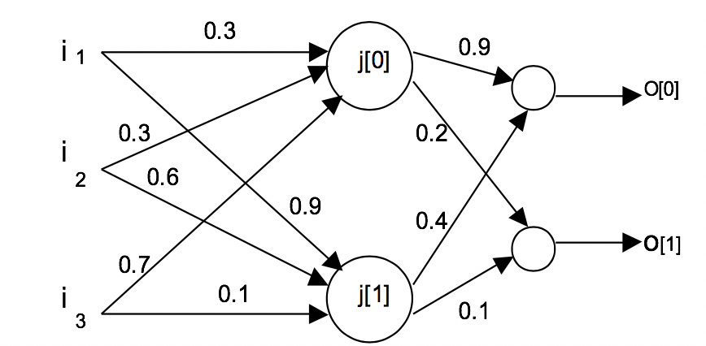

# Intelligent Systems : Homework 2

EEL5934 SUMMER 2019;
Hector Lopez

## 1. Consider a multi layer feed forward network, all the neurons, which operate with linear activation functions. Justify the statement that such a network is equivalent to a single layer feed forward network.

A single layer feed forward network with all linear activation functions creates a linear output that if acted upon by another layer in a multi layer network will also produce a linear output. It is similar to having a linear regression line from a set of points and then taking the linear regression of the line. It will result in the same line. In this way a multi layer feed forward network becomes the same as a single layer feed forward network if it only has linear activation at each neuron.


## 2.	Consider the following network with the inputs and outputs as follow:

Where : i1=0.8, i2=1, i3=0.9 with O_0 = O_1 = 1



Step 1.

```
J[0] = f(Wj[0].I) = f(0.3*0.8 + 0.3*1 + 0.7*0.9) = f(1.17) = 0.763
J[1] = f(Wj[1].I) = f(0.9*0.8 + 0.6*1 + 0.1*0.9) = f(1.41) = 0.803
O[0] = f(Wk[0].J) = 1.00833
O[1] = f(Wk[1].J) = 0.23300
```
Step 3. Calculate Errors:
Given an arbitrary desired value  d0 = 1, d1 = 1, we can adjust for an error:
```
∆k[0] = d0 - k[0] = 1 - 1.00833 = 0.00833 
∆k[1] = d1 - k[1] = 1 - 0.23300 = 0.767
```
Step 4. Update the weights and repeat. 

To show the full steps a matlab snippet was used to create two sequential propogations.

```matlab

%% Initial feed forward calc

I0=0.8;
I1=1;
I2=0.9;
I = [I0;I1;I2];

% Set initial weights 
WJ00=0.3;WJ01=0.3;WJ02=0.7;
Wj0 = [0.3 0.3 0.7];

WJ10=0.9;WJ11=0.6;WJ12=0.1;
Wj1 = [0.9 0.6 0.1];

Wk00 = 0.9; Wk01=0.4;
Wk0= [Wk00 Wk01];
Wk10=0.2;Wk11=0.1;
Wk1= [Wk10 Wk11];

J0 = sigmoid(Wj0*I);
J1 = sigmoid(Wj1*I);
J=[J0;J1];

O0 = linear(Wk0*J);
O1 = linear(Wk1*J);

k0=O0;
k1=O1;

%get error 
d0=1;d1=1;%desired output
d_k0 = d0 - k0;
d_k1 = d1 - k1;

fprintf("Initial itteration : error O0=%f , O1=%f \n",d_k0,d_k1);

%dereive wieghts through back propogatio
n=1; %learning rate

Wk00 = Wk00 + n * d_k0 * sigmoid_prime(k0)*J0;
Wk01 = Wk01 + n * d_k0 * sigmoid_prime(k0)*J0;

Wk10 = Wk10 + n * d_k1 * sigmoid_prime(k1)*J1;
Wk11 = Wk11 + n * d_k1 * sigmoid_prime(k1)*J1;

%Use weights from output layer into first layer
WJ00 = WJ00 + n* I0*(Wk00*d_k0 + Wk01*d_k1);
WJ01 = WJ01 + n* I1*(Wk00*d_k0 + Wk01*d_k1);
WJ02 = WJ02 + n* I2*(Wk00*d_k0 + Wk01*d_k1);

WJ10 = WJ10 + n* I0*(Wk10*d_k0 + Wk11*d_k1);
WJ11 = WJ11 + n* I1*(Wk10*d_k0 + Wk11*d_k1);
WJ12 = WJ12 + n* I2*(Wk10*d_k0 + Wk11*d_k1);


%% Itteration 1 - train on error correction

% Set updated weights 
Wj0 = [WJ00 WJ01 WJ02];
Wj1 = [WJ10 WJ11 WJ12];
Wk0= [Wk00 Wk01];
Wk1= [Wk10 Wk11];

J0 = sigmoid(Wj0*I);
J1 = sigmoid(Wj1*I);
J=[J0;J1];

O0 = linear(Wk0*J);
O1 = linear(Wk1*J);
k0=O0;
k1=O1;

%get error 
d0=1;d1=1;%desired output
d_k0 = d0 - k0;
d_k1 = d1 - k1;

fprintf("First itteration : error O0=%f , O1=%f \n",d_k0,d_k1);

%dereive wieghts through back propogatio
n=1; %learning rate

Wk00 = Wk00 + n * d_k0 * sigmoid_prime(k0)*J0;
Wk01 = Wk01 + n * d_k0 * sigmoid_prime(k0)*J0;

Wk10 = Wk10 + n * d_k1 * sigmoid_prime(k1)*J1;
Wk11 = Wk11 + n * d_k1 * sigmoid_prime(k1)*J1;

%Use weights from output layer into first layer
WJ00 = WJ00 + n* I0*(Wk00*d_k0 + Wk01*d_k1);
WJ01 = WJ01 + n* I1*(Wk00*d_k0 + Wk01*d_k1);
WJ02 = WJ02 + n* I2*(Wk00*d_k0 + Wk01*d_k1);

WJ10 = WJ10 + n* I0*(Wk10*d_k0 + Wk11*d_k1);
WJ11 = WJ11 + n* I1*(Wk10*d_k0 + Wk11*d_k1);
WJ12 = WJ12 + n* I2*(Wk10*d_k0 + Wk11*d_k1);

%% Itteration 2 - train on error correction

% Set updated weights 
Wj0 = [WJ00 WJ01 WJ02];
Wj1 = [WJ10 WJ11 WJ12];
Wk0= [Wk00 Wk01];
Wk1= [Wk10 Wk11];

J0 = sigmoid(Wj0*I);
J1 = sigmoid(Wj1*I);
J=[J0;J1];

O0 = linear(Wk0*J);
O1 = linear(Wk1*J);

k0=O0;
k1=O1;

%get error 
d0=1;d1=1;%desired output
d_k0 = d0 - k0;
d_k1 = d1 - k1;

fprintf("Second itteration : error O0=%f , O1=%f \n",d_k0,d_k1);
```

Output :

>> backprop
Initial itteration : error O0=-0.834243 , O1=0.577690 
First itteration : error O0=4.012801 , O1=-7.469955 
Second itteration : error O0=-0.359911 , O1=5.116617 


## 3. 3.	Suppose for problem 2, the inputs and the outputs are as follow:
i1= 12; i2=3, i3=8  and  do= 9, d1=1

How do you scale the inputs and outputs data sets?


## 4.	Compare the radial basis functions neural network and back propagation in term of various aspects  related to training, convergence, and applications.
