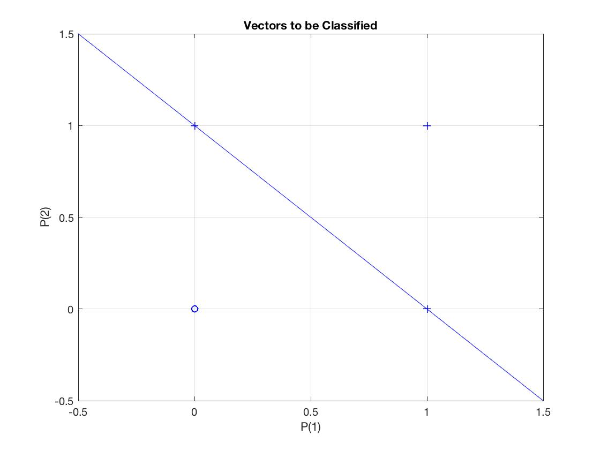
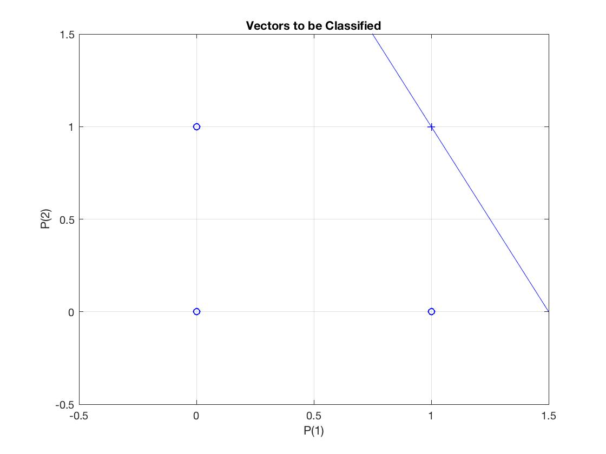

# MATLAB Project#2 (Intelligent Systems-Summer 2019)

## 1. Consider    the  following    OR  gate,  use  Matlab  with  a  single  perceptron    to  solve  the problem. 


| Input(X1)        | Input(X2)           | Output (Y) |
|:-- |------------- |:-------------:| -----:|
| 0 | 0 |0 |
|0 | 1 | 1 |
|1 | 0 | 1 |
|1 | 1 | 1 |

### Perceptron Learning:
Using a single perceptron we need to update the weights and bias until it produces the correct targets for the inputs.

#### Define Components
The input to the perceptron will be two inputs X1, and X2. We will call the input vector 'p'. Since we have many cases we want to train against, we can use a matrix to represent p = [X1;X2] and have X1 and X2 be vectors coresponding with the output vector Y.
```
if , X1 = [0 0 1 1] and X2 = [0 1 0 1] then

(input) p = [0 0 1 1; 0 1 0 1]
```
We need to include a bias value and an epoch time to limit the number of itterations we make in case a final value cannot be generalized. Lets choose bias = 0, so that it can trigger the actiavtion in a binary way. We can also choose an epoch of 20 to reduce run time. The weights should start off small so we will choose a [0,0] vector.
```
(wieght) W = [0 0]
(epoch) ep = 20
(bias)  b = 0
```
#### Output Error
We must measure the output of the perceptron against the input vector and then get a scalar error value. To get the output we must first multiply all of the inputs by the weights and then sum and pass into a hard activation function. The output 'a' can be subtracted from the target vector 't' 
```

Desired output 'Y' is target vector ;
(target) t = [0 1 1 1]

(error) e = t - a ; where 'a' is output in training
```

#### Training Steps
Every itteration we will update the each weight by adding the old weight plus the product of the input and the error. The bias will be adjusted by just adding the error to it. We will then evaluate the net using the activation function on the sum of the bias and the weighted inputs. The error will be calculated from the output of the net on that itteration against the desired vector that will stay constant throughout. If the error value is not 0 then we can update the weights and bias and try again.

```    
1. w_new = w_old + (e * p)
2. b_new = b_old + e
3. a = activate( (w_new * p) + b_new )
4. e = t - a
5. b_old = b_new
6. w_old = w_new
4. if e is not 0 and, if epoch limit is not reached ; repeat
```

> Note: The activation typically involves summing weighted inputs, but when we multiply vectors w_new, and p the vector multiplication is summing the multiplied elements and providing a scalar for every dimension/input of p. So in the code we do not use a explicit summing function just multiply the vectors and add the bias.


### Code Design


#### Hard Limit Activation :
We can have a hard activation function for the perecptron that will provide a binary output of 0 or 1.

```matlab
function out=hardlimit(in)
% Hard limit function
% out = 0 if in<0
% out = 1 if in>=0
for i=1:numel(in)
    if in(i)<0
        out(i)=0;
    else
        out(i)=1;
    end
end
```

#### Training Perceptron :
The following code snippet was referenced from MATLAB's documentation on a single perceptron learning. The function provides weights and bias's as an output that can be used to evaluate againt any activation function for testing other inputs. The "chk" vairable is used to add a round of verification on the system making sure that all values are equal to the target for 5 extra itterations. This may be because of possible instabilities when starting from random weights that may occur and not allow the systme to settle at a 0 error minima.

```matlab
function [w,b]=perceplearn(P,t,w,b,ep)
% plot the input and target
plotpv(P,t)
linehandle = plotpc(w,b); grid on

[r c]=size(P);
chk=0; iter=0;
while chk~=5
    for i=1:c
        a=hardlimit(w*P(:,i)+b); % Evaluating Network
        chk=chk+1;
        if chk==5
            break; % If w and b are adjusted as required.
        end
        if a~=t(i) %output not equal to target so adjust weights and bias
            chk=0;
            e=t(i)-a;
            w=w+(e*P(:,i)');
            b=b+e;
        end
        pause(0.2)
        linehandle = plotpc(w,b,linehandle);  drawnow;
    end
    iter=iter+1
    if iter==ep
         disp('Maximum Iterations Reached');
        break;
    end
end
disp('=============================================================')
disp('To verify the w and b for given input and targets Run following:')
disp('T=evalnet(P,w,b);')

```

#### Testing Trained Perceptron:

```matlab
function T=evalnet(P,w,b)
% Verify your inputs with targets using w & b 
% obtained by perceplearn function.
% T = Targets
% P = Input
% w = weight
% b = bias
T=hardlimit(w*P+b);
```

### Training and Testing the OR Gate

```matlab
% OR Gate: 
P=[0 0 1 1; 0 1 0 1]; 
t=[0 1 1 1]; 
w=[0 0]; 
b=0; 
ep=20; 

% Training:
[w b]=perceplearn(P,t,w,b,ep);

% Testing:
X = [1;0];
Y = evalnet(X,w,b);
disp("the perceptron says 1 OR 0 = " + Y);
```

### Results

Decision Surface :




```

iter =

     1


iter =

     2


iter =

     3


iter =

     4

=============================================================
To verify the w and b for given input and targets Run following:
T=evalnet(P,w,b);
the perceptron says 1 OR 0 = 1
```


## 2. Assume  AND  gate,  use  a  perceptron    with  two  input and  one  output    to  solve  the problem.


| Input(X1)        | Input(X2)           | Output (Y) |
| ------------- |:-------------:| -----:|
| 0 | 0 | 0 |
| 0 | 1 |  0 |
| 1 | 0 | 0 |
| 1 | 1 | 1 |


### Training and Testing the AND Gate

```matlab
% AND Gate: 
P=[0 0 1 1; 0 1 0 1]; 
t=[0 0 0 1]; 
w=[0 0]; 
b=0; 
ep=20; 

% Training:
[w b]=perceplearn(P,t,w,b,ep);

% Testing:
X = [1;0]
Y = evalnet(X,w,b);
disp("the perceptron says 1 AND 0 = " + Y);
```

### Results

Decision Surface :



```
iter =

     1


iter =

     2


iter =

     3


iter =

     4


iter =

     5


iter =

     6

=============================================================
To verify the w and b for given input and targets Run following:
T=evalnet(P,w,b);

X =

     1
     0

the perceptron says 1 AND 0 = 0
```

## 3. Consider the following 2-D  inputs:[{-1, -2}, {-1,0}] = C1 and [{2,3}, {4,1}] = C2 where  C1 is associated with the target zero and C2 is associated with the target one.

### (a)Use MATLAB to solve the classification problem. What is the decision surface for this problem?


```
C1 = {
    x1=[-1;-2];
    x2=[-1;0];
}

C2= {
    x3=[2;3];
    x4=[4;1];
}

w1=[0 0]

Itteration 1: 
    w1*x1=0

    %update wieghts with '+' because its 0 and x(k) is an elemnt of C1 
    w2=w1+x1 = [-1 -2]

Itteration 2: 
    w2*x2=1

    %do not update wieghtr because it is greater than 0 and x(k) is an element of C1

    w3=w2

Itteration 3: 
    w3*x3=-8

    %do not update wieghtr because it is less than 0 and x(k) is an element of C2

    w4=w3

Itteration 4: 
    w3*x3=-6

    %do not update wieghtr because it is less than 0 and x(k) is an element of C2


```

The decision surface is hten defined by the weights [-1 -2]. and can be written as :

```
d(x) = -X1 - 2*X2 = 0
```


### (b)Suppose the new data input is {-2, -2}. Show that your proposed classification is valid.

with a new data input we can use the weiths [-1 -2]
[-1 -2]*[-2;-2] = 6 > 0   Correct Classification.


Graphed out surface :


```python
import matplotlib.pyplot as plt

x1 = [-1,-1]
y1 = [-2,0]
x2 = [2,4]
y2 = [3,1]

plt.scatter(x1,y1, c='b', marker='x', label='C1')
plt.scatter(x2, y2, c='r', marker='s', label='C2')
plt.scatter(-2, -2, c='g', marker='o', label='New')

plt.show()
```