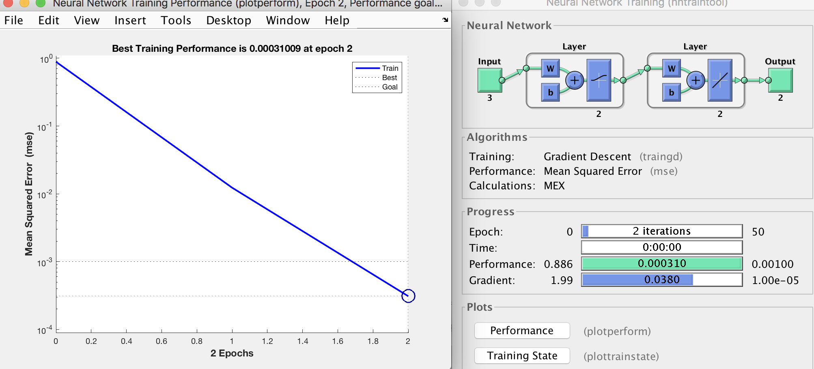
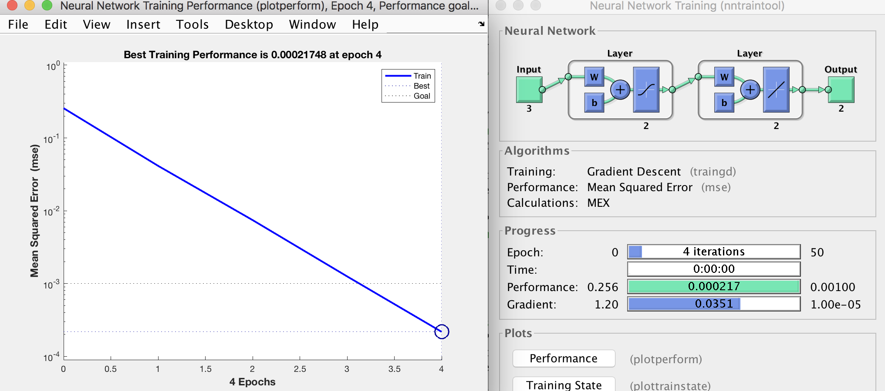
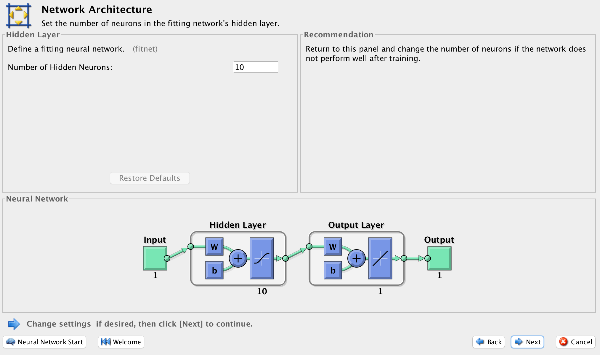
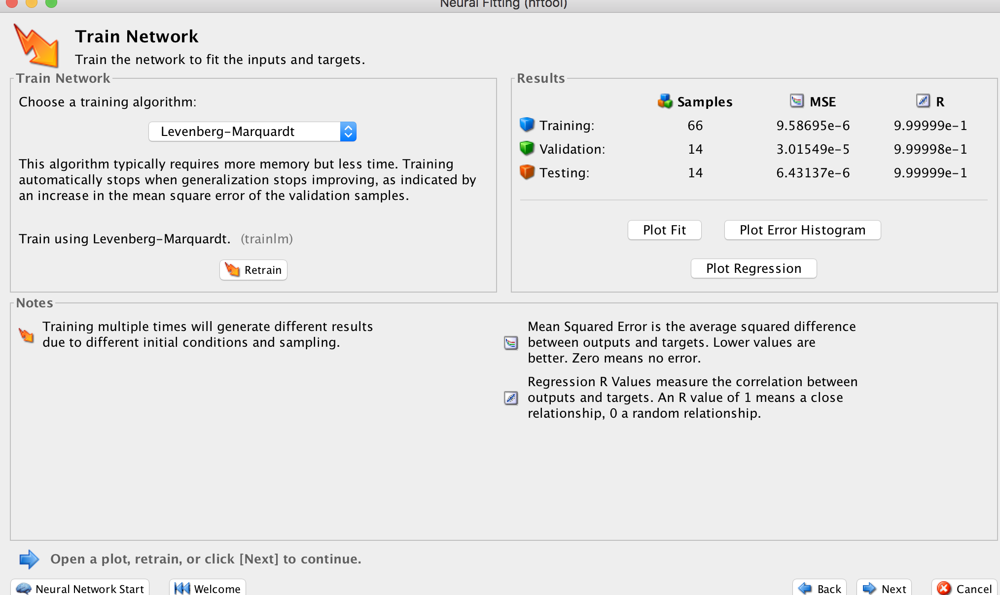
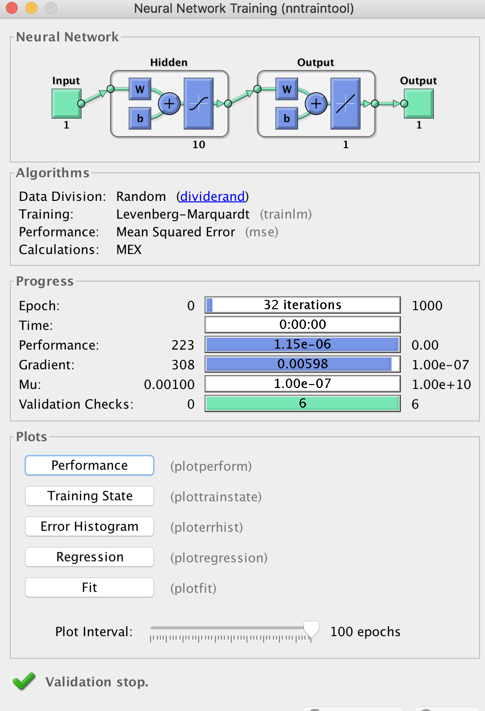
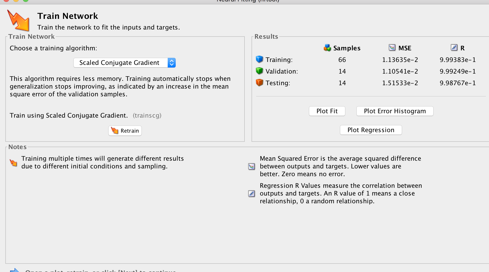
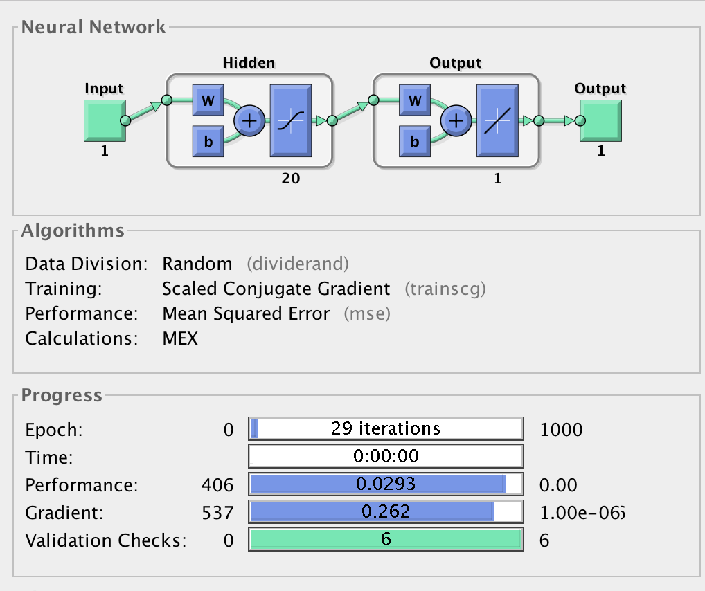
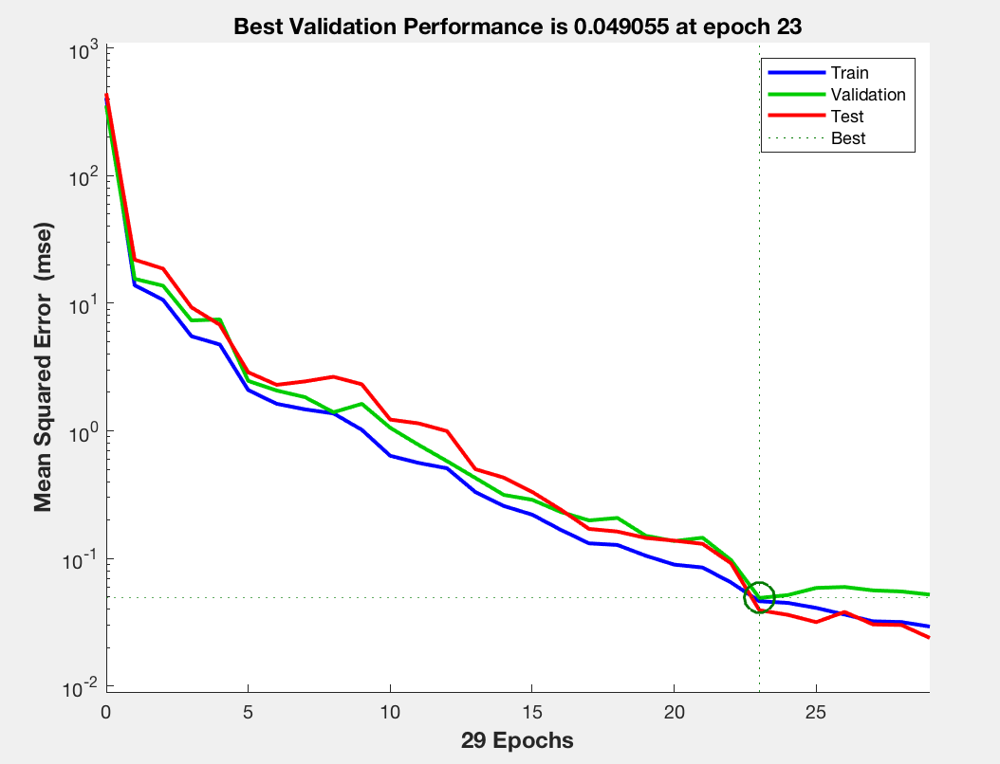
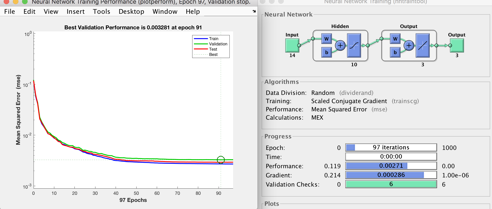

# MATLAB Project#3 (Intelligent Systems-Summer 2019)

## Problem #1 Consider the following network with the inputs and outputs as follow:

### (1.1) Use the sample code and run in matlab given the correct inputs and desired output.

```matlab
P=[0.8; 1; 0.9];   % Input Sample
T=[1; 1];  %Desired Output
%Creating the network
net = newff([0 1 ; 0 1 ; 0 1],[2 2],{'logsig' 'purelin'},'traingd');
net.iw{1,1}=[0.3 0.3 0.7;0.9 0.6 0.1]; % Input Weights
net.b{1}=[0; 0];  % Input Threshold Weights = 0
net.lw{2,1}=[0.9 0.4;0.2 0.1]; % Hidden Layer weights
% Printing the Weights
input_layer_weight = net.iw{1,1} 
Hidden_layer_weight = net.lw{2,1}
Bias_weights = net.b{1}
Initial_Output=sim(net,P);
% Setting Training Parameters
net.trainParam.lr = 0.5;
net.trainParam.epochs = 50;
net.trainParam.goal = 0.001;
net = train(net,P,T);  % Training the Network
% Evaluating the results
Final_Output = sim(net,P)
input_layer_weight = net.iw{1,1}
Hidden_layer_weight = net.lw{2,1}
Bias_weights = net.b{1}

```

#### Performance : 
Using sigmoid activation function in the first layer. The network is trained with a learning rate of 0.5, and max epochs of 50 . The goal is to reach an MSE of 0.001.
The system trained achieved that error in only 2 epochs. 




#### Output :
```
input_layer_weight =

    0.3000    0.3000    0.7000
    0.9000    0.6000    0.1000


Hidden_layer_weight =

    0.9000    0.4000
    0.2000    0.1000


Bias_weights =

     0
     0


Final_Output =

    0.9960
    0.9754


input_layer_weight =

    0.3005    0.3006    0.7006
    0.8980    0.5974    0.0977


Hidden_layer_weight =

    0.8374    0.3341
    0.6433    0.5672


Bias_weights =

    0.0006
   -0.0026

```

### (1.2) using hyperbolic tangent for first layer and linear activation for second layer.

```matlab
P=[0.8; 1; 0.9];   % Input Sample
T=[1; 1];  %Desired Output
%Creating the network
net = newff([0 1 ; 0 1 ; 0 1],[2 2],{'tansig' 'purelin'},'traingd');
net.iw{1,1}=[0.3 0.3 0.7;0.9 0.6 0.1]; % Input Weights
net.b{1}=[0; 0];  % Input Threshold Weights = 0
net.lw{2,1}=[0.9 0.4;0.2 0.1]; % Hidden Layer weights
% Printing the Weights
input_layer_weight = net.iw{1,1} 
Hidden_layer_weight = net.lw{2,1}
Bias_weights = net.b{1}
Initial_Output=sim(net,P);
% Setting Training Parameters
net.trainParam.lr = 0.5;
net.trainParam.epochs = 50;
net.trainParam.goal = 0.001;
net = train(net,P,T);  % Training the Network
% Evaluating the results
Final_Output = sim(net,P)
input_layer_weight = net.iw{1,1}
Hidden_layer_weight = net.lw{2,1}
Bias_weights = net.b{1}

```

#### Performance :

The output shows what the initial wieghts defined in the problem. The network is trained with a learning rate of 0.5, and max epochs of 50 . The goal is to reach an MSE of 0.001.
The system trained achieved that error in only 4 epochs. 



#### Output : 

```
input_layer_weight =

    0.3000    0.3000    0.7000
    0.9000    0.6000    0.1000


Hidden_layer_weight =

    0.9000    0.4000
    0.2000    0.1000


Bias_weights =

     0
     0


Final_Output =

    0.9854
    0.9675


input_layer_weight =

    0.3058    0.3072    0.7065
    0.9008    0.6010    0.1009


Hidden_layer_weight =

    0.8966    0.3964
    0.3391    0.2507
```

### (1.3) Suppose  we  select  different  initial  conditions.  Are  the  final  weights  the  same?  

```matlab
P=[1; 1; 1];   % Input Sample
```

With a different initial condition the neural net will try to train itelf to meet the desired output. But with only a single input to start with the system will only learn to provide the output and tweak coefficients for a single input and thus not be able to tweak enough to generalize. The weights will be different to different starting conditions if its all that is used to train with.

#### Output :
```
input_layer_weight =

    0.3000    0.3000    0.7000
    0.9000    0.6000    0.1000


Hidden_layer_weight =

    0.9000    0.4000
    0.2000    0.1000


Bias_weights =

     0
     0


Final_Output =

    0.9948
    1.0217


input_layer_weight =

    0.2283    0.2283    0.6283
    0.8716    0.5716    0.0716


Hidden_layer_weight =

    0.6382    0.1292
    0.6445    0.5674


Bias_weights =

   -0.0717
   -0.0284
```


## Problem #2 Suppose for above problem , the inputs and the outputs are as follow:

```matlab
P=[12; 3; 8];   % Input Sample
T=[9; 1];  %Desired Output
```

#### How do you solve the problem with appropriate scaling of the inputs and outputs data sets.

By normalizing against the largest value of the input and output then all of the values could then be scaled back to the original.

```
P=[12; 3; 8];   % Input Sample
T=[9; 1];  %Desired Output
P_norm =

    1.0000
    0.2500
    0.6667

T_norm = 

    0.7500
    0.0833
```

## Problem #3 -Please open  the MATLAB  application, and do the following steps: 

### (3.1) Go  to NN Fitting application toolbox (nftool):


### (3.2) Load Simplefit dataset


## (3.3) Select default value for Training, validation and testing with 10 hidden layers





### (3.4) Train  the network with BP algorithm






### (3.5) Review the performance of your network. Try  at least four different options with the same data. Provide the best NN performance as  your solution. Justify your answer.






Retraining with Scaled Conjugate Gradient yielded a MSE with lesser epochs. Then the hidden layer neurons where increased to 20 from 10 yeilding only slightly better performance.



## Problem #4 Repeat Problem #3  for building  energy data base using the same toolbox.

Multiple training methods where attempted when training. The best was a scaled conjugate gradient to reduce the epoch itterations. This training data set was very different and seemed to converge much better regardless of the training method chosed compated to the simple fit data. 



