# MATLAB Project#4 (Intelligent Systems-Summer 2019)

## Problem#1:Let’s select c/m = 0.2, k/m = 0.4 and 1/m = 0.2 for the figure 2. Select x(0) =1 and x(0) = 0. Simulate the model for step input.

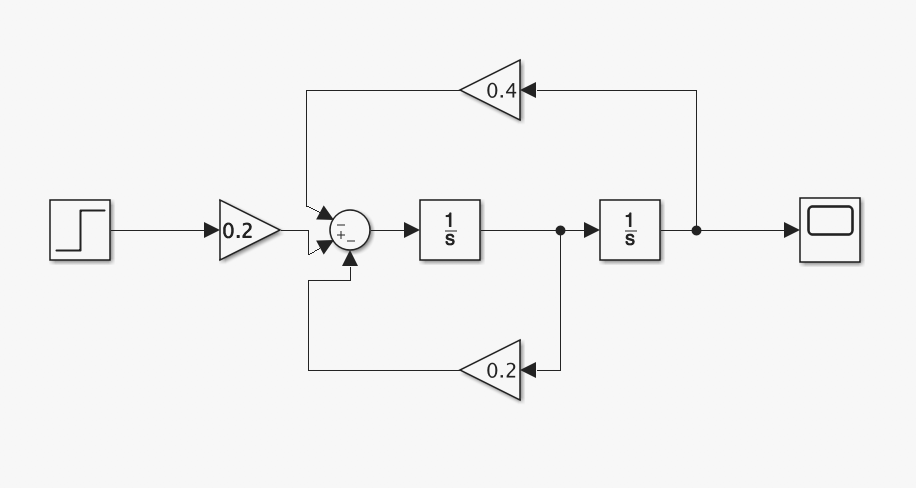

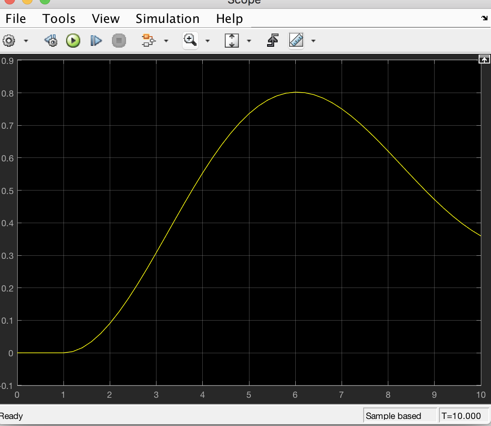

## Problem#2:Let’s select c/m = 1, k/m = 1 and m = 1. Repeat problem#1

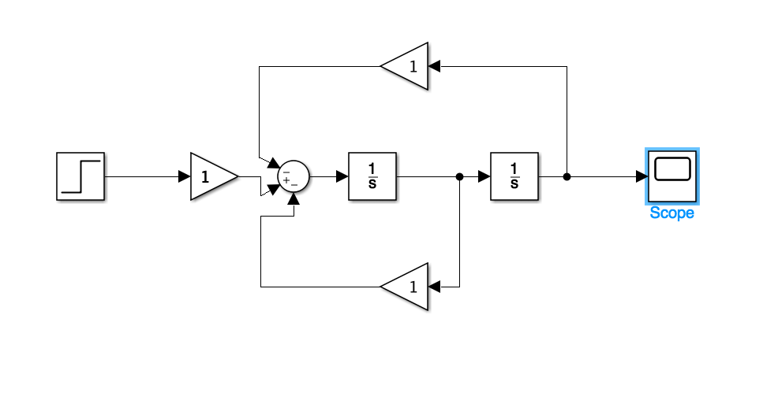

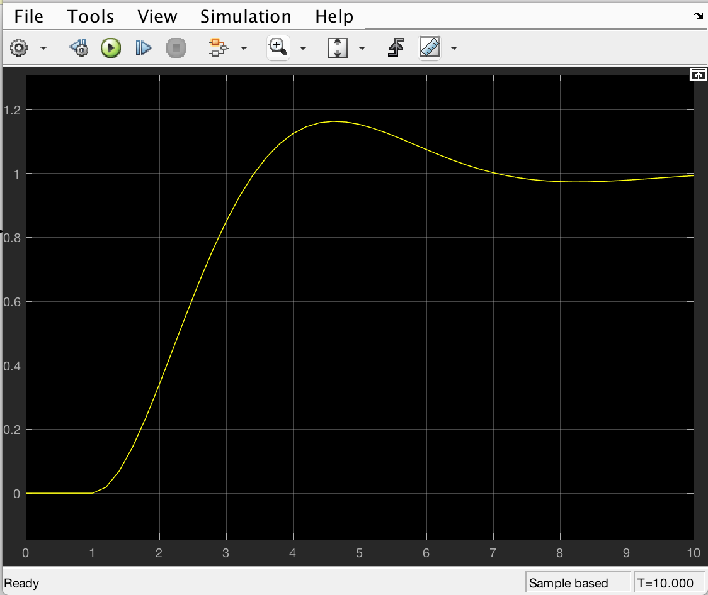

## Problem#3:Draw the diagram for problem#1 in one block (as shown in figure3) then repeat the simulation.

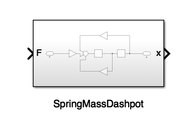

## Problem#4: 

## (I)Select k = 1, 5, 10 for positive and negative feedback systems. Observe the output with the step input. What is the effect ofk to the output response?

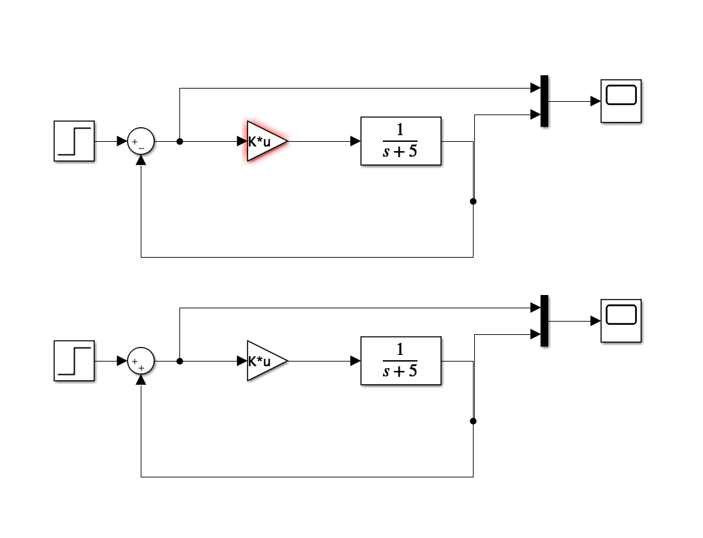

K=1:
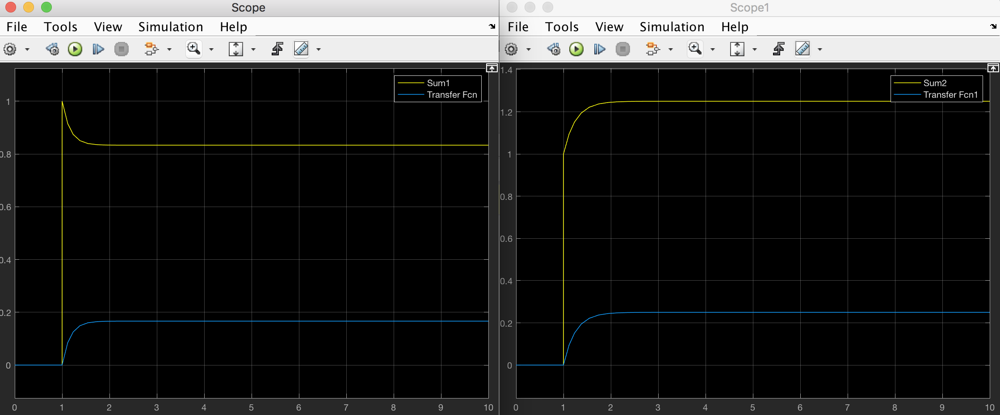
K=5:
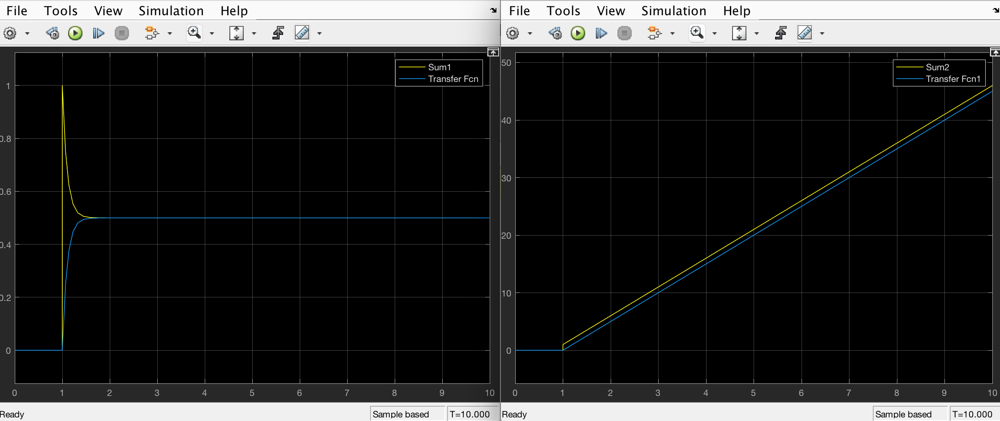
K=10:
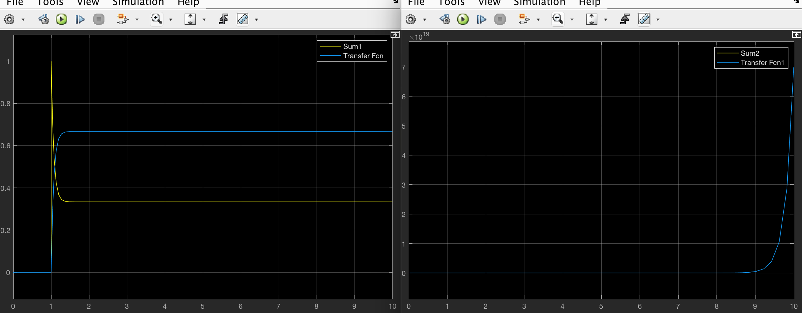

## (II) change  your input to a pulse generator(Select the value of your input p parameters as desire). Show your output for K=50

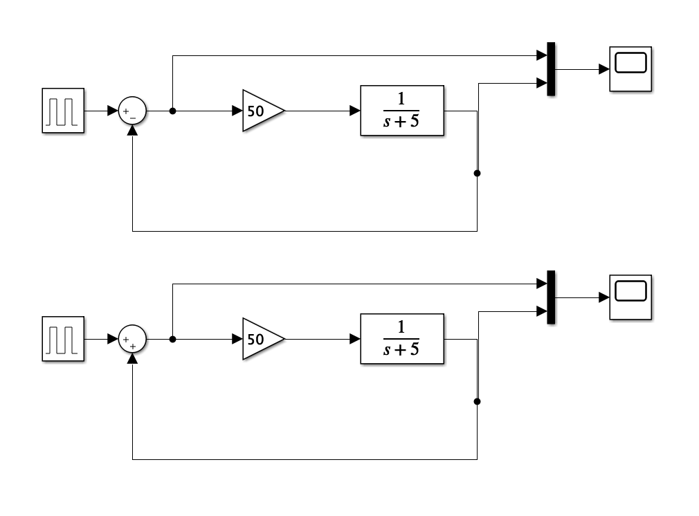

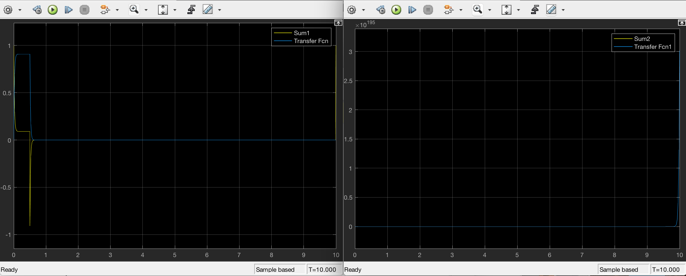

