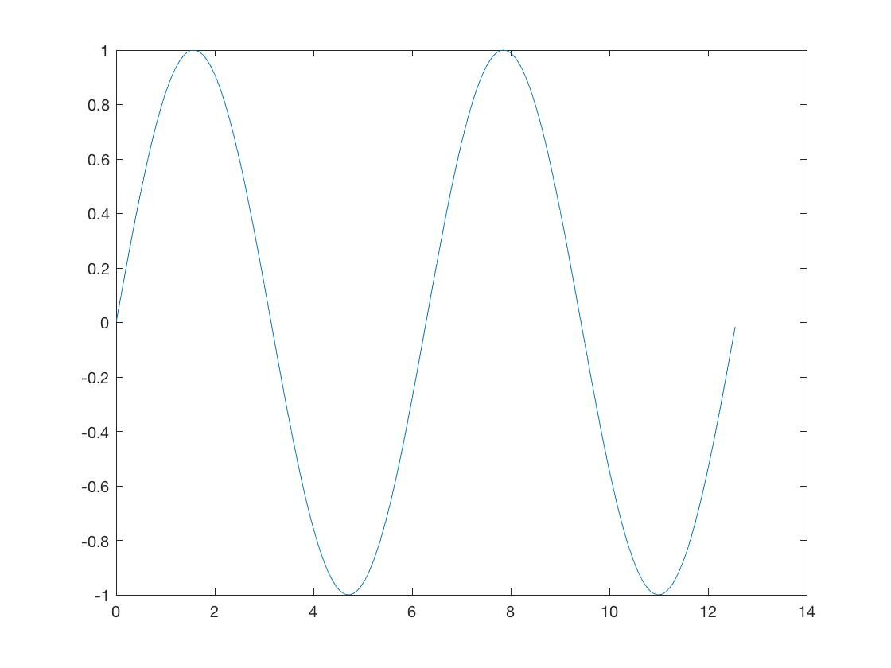
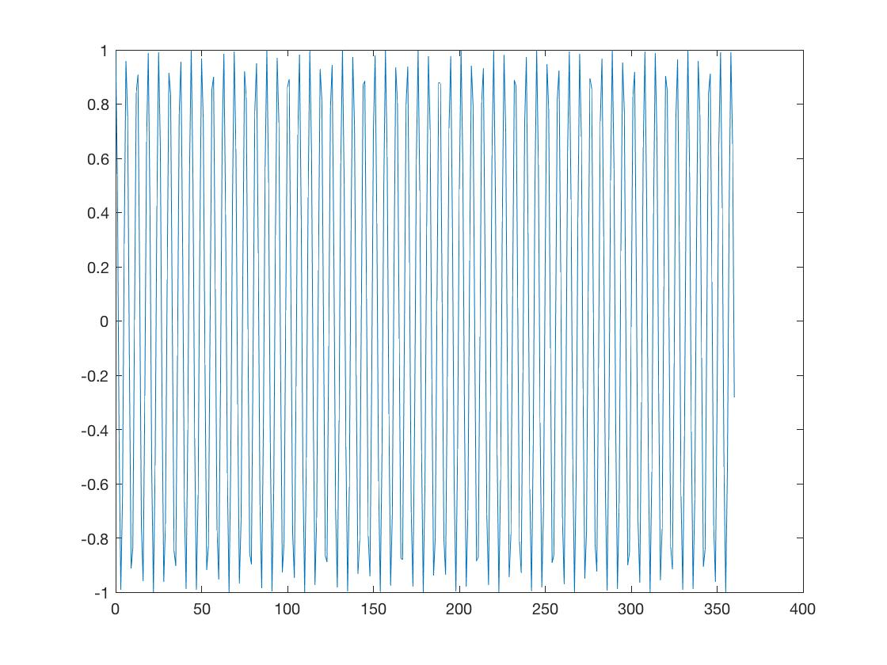
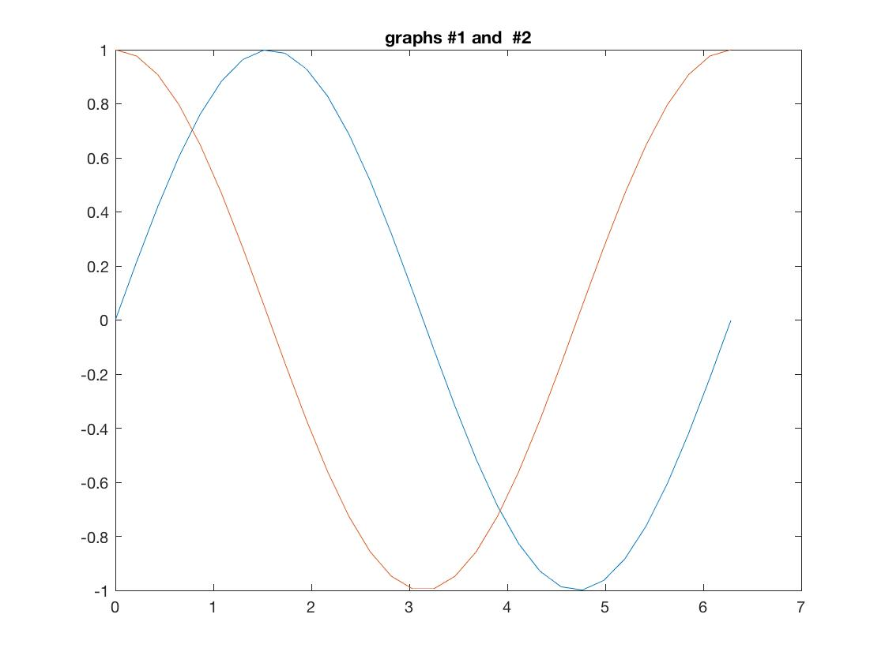

## Example 1
```
>> A = [1,2,-1;2,-1,1;1,1,-2]

A =

     1     2    -1
     2    -1     1
     1     1    -2

>> b=[4,1,3]

b =

     4     1     3

>> b=[4;1;3]

b =

     4
     1
     3

>> w=inv(A)*b


w =

    1.2500
    1.2500
   -0.2500

>> 
```

Solving for x,y,z  :

x=1.25
y=1.25
z=-0.25


## Example 2
```
>> A

A =

    0.1000    2.3000    3.0000    4.0000
    1.0000    3.0000   -7.0000    5.0000
    3.0000    2.0000    7.0000         0
    1.0000    2.0000    1.0000   10.0000

>> b = [1;2;3;0]

b =

     1
     2
     3
     0

>> x = inv(A)*b

x =

    0.5099
    0.8015
   -0.0189
   -0.2094

```


## Example 3
```
>> p=[2, 3, 5];x=roots(p)

x =

  -0.7500 + 1.3919i
  -0.7500 - 1.3919i
```

## Example 4
```

>> q=[4,0,15,2,8,3,1];x=roots(q)

x =

   0.0513 + 1.7716i
   0.0513 - 1.7716i
   0.1685 + 0.7845i
   0.1685 - 0.7845i
  -0.2198 + 0.2744i
  -0.2198 - 0.2744i

>> p=[1,2,3,0,5,12,0,7,4];x=roots(p)

x =

  -1.2386 + 1.7164i
  -1.2386 - 1.7164i
  -1.4522 + 0.0000i
   0.9207 + 0.9937i
   0.9207 - 0.9937i
   0.2683 + 0.8217i
   0.2683 - 0.8217i
  -0.4484 + 0.0000i

```

## Example 5
THis example shows that after the end of a line we mut end it with ';' or it would overwhelm the conole with data if it is a large output.

```
>> t=[0:  0.05: 4*pi]

t =

  Columns 1 through 6

         0    0.0500    0.1000    0.1500    0.2000    0.2500

  Columns 7 through 12

    0.3000    0.3500    0.4000    0.4500    0.5000    0.5500

  ...

   11.7000   11.7500   11.8000   11.8500   11.9000   11.9500

  Columns 241 through 246

   12.0000   12.0500   12.1000   12.1500   12.2000   12.2500

  Columns 247 through 252

   12.3000   12.3500   12.4000   12.4500   12.5000   12.5500

>> y=sin(t)

y =

  Columns 1 through 6

         0    0.0500    0.0998    0.1494    0.1987    0.2474

  Columns 7 through 12

    0.2955    0.3429    0.3894    0.4350    0.4794    0.5227

  Columns 13 through 18

    0.5646    0.6052    0.6442    0.6816    0.7174    0.7513

  ...
   -0.5366   -0.4937   -0.4496   -0.4044   -0.3582   -0.3111

  Columns 247 through 252

   -0.2632   -0.2147   -0.1656   -0.1161   -0.0663   -0.0164

>> plot(y)
>> 

```

When the commands are executed with a semicolon the output is hidden.

```

>> t=[0:  0.05: 4*pi];y=sin(t);plot (t,y)
```

Output Plot :


## Example 6

```
>> alfa = [0:1:360];z=cos(alfa);plot (alfa,z)
```

Output Plot :


## Example 7

A trigplot.m file was created with the following code :
```
m=linspace(0, 2*pi, 30);y=sin(m);z=cos(m);plot(m,y,m,z), title("graphs #1 and  #2")
```
The file was saved in the working matlab directory and ran by typing the following int he command line :
```
>> trigplot
>> 
```
Output Plot :

