# Review

## Array Response Vector
The array response vector is a Mx1 vector, where M is the number of antenna elements. Each element of the vector is made of a complex number `e^-j*2*PI*(d/lambda_c)*sin(theta)`. This vector describes how your antenna response to any incoming signal with respect to the broadside (straight ahead) direction. We found out that this is a function of the inter-element spacing and the carrier wavelength. 

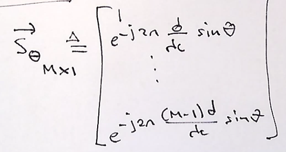

## Nyquist Theorem for Spacing
We also found out that in order to satisfy Nyquists sampling theorem in the space dimension, the inter element spacing `d` should be less than or equal to half the wavelength of the carrier signal. Therefore if you would like to save antenna elements you would try to satisfy Nyquist theorem.

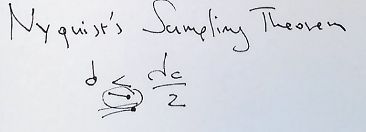

## Zero forming BeamFormer
The ZF beamforming considers all array response vectors of interest and then combine it with an array that will provide weights necessary to achieve the preservation of thetas.

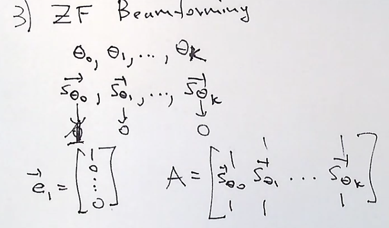

The hermitian of the weights is provided when solving for the array response matrix. This method is considered when A is square , but if it is less then we use the Moore-Penrose formula for the matrix A.

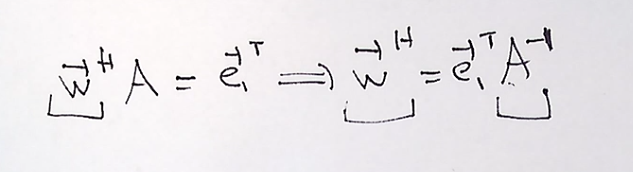

The power beam patterns of an array is determined when `m(t) = 1` for all of `t` . Notice tha thte carrier frequency component is equal to 1 for all `t`. Therefore when |y(t)|^2 is plotted the carrier component goes away.

## One Signal - Optimal Beam Forming with AWGN 
An incoming signal where the carrier carries noise. So we consider the problem where the recieved vector wave consists of the signal of interest x(t), plus some additive white gaussian noise vector n(t). 

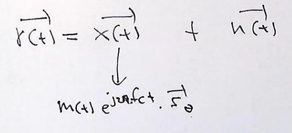

When we are interested in collecting a signal with noise we found out that the weights can be arranged to provide the maximum SNR by setting the weights to some scaled version of the array response vector itself. This is called the optimal beam former to receive the optimum SNR for a specific signal. 

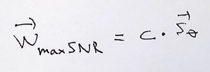

# One Signal AWGN and Interference Beam Forming

This is the case where the received signal r(t) plus some AWGN noise signal n(t) plus i(t). notice that if i(t) is white then the formula drops back to a single noise vector when combined. 

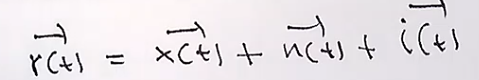

Lets assume a array elements in the form of the following. where the recieved signals are multiplied by the conjugate wheights and then summed together to create the y(t). 

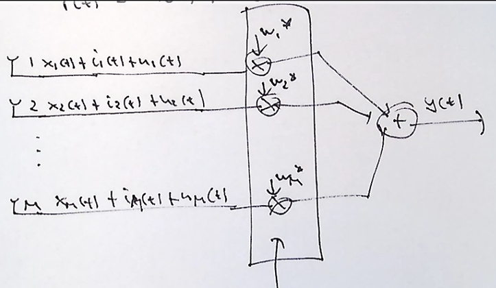

Similarly to the SNR optimization we can derive the weights needed to provide the maximum SINR (signal interference noise ratio). 
We start by defining the SINR as the expected wegiths of the input signal over the expected weights of the interference and noise signals. 

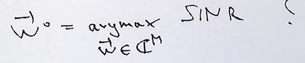

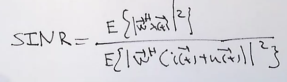

`W_Max_SINR` is any scaled version of the distutbance of the autocoreelation array respnse vector times the arrary response vector.

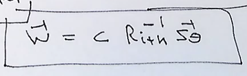

we need to know the angle of arrival of the incoming signal and the auto correlation of the whole i+n received.

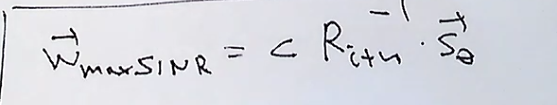

### Summary

> Q : What is the Maximum SINR value that you get ?

> A: 
    1. Use the SINR equation in terms of z

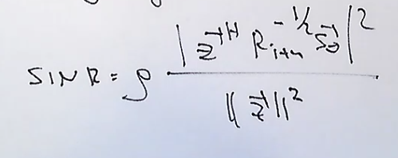

    2. plugin by shqarz z vector at any scaled version of the autocorrelation function inverse one hald time s_theta.

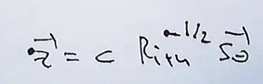

    3. You will get the SINR in terms of :

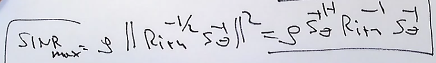

    4. we then get the max wieghts for the SINR in the form of  : 

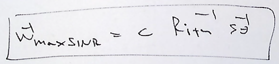

Note : if R(i+n) is not known then it may need to be estimated. 

## New System to minimize error

In an ideal world the y(t) would only contain the disred signal of interests. We can call that `d(t)`, total elimination of interference and noise. if that not true then if i subtract from y(t) this d(t) i would have been left with an error d(t).

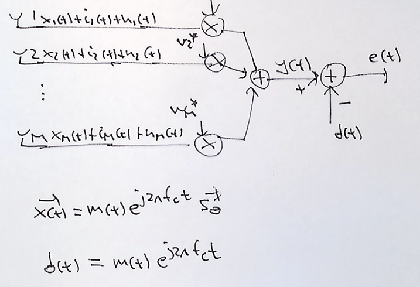

So my best approach is to find a way to minimize the error. We can try to minimize the average magnitude of the error. 

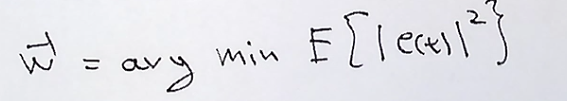

What is the minimum-mean-squared-error vector W?
If we can find this weight vector we can reduce the error signal to its minimum amount. 

We are intersted in the average square magnitude defined as the actual system output minus the desired output. where the actual output is comprised of a input signal x(t) plus interference i(t) plus AWGN noise n(t).

