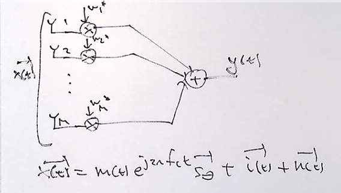
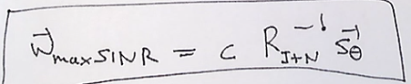
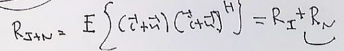
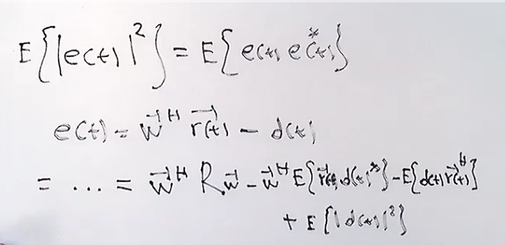
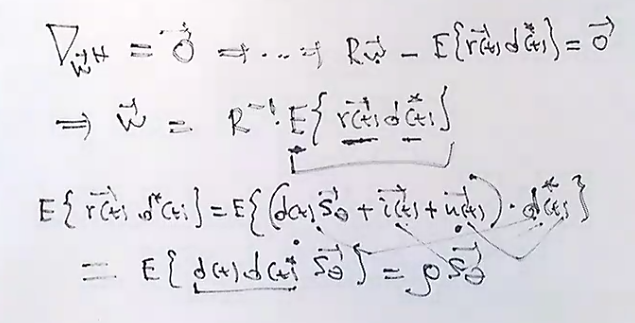
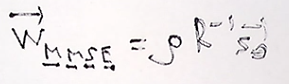
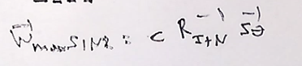

# Review

M-elements that are recieving a signal at a corresponding angel of arrival `theta` there is a S_theta that characterizes the response of the antenna array. 

When designing hte specifications of the antenna array the system can be manipulated with weight vectors to provide the intended response. 

With a zero forcing beam forming we can manipulate the antenna array response to provide the signal that only comes at desired angles. 

We can then create another type of beam former that takes one signal in the presence of interference and white gaussian noise.

If you are interested in finding the weight vector that maximizes the SINR. The solution would be any multiple of the autocorrelation matrix of interference plus noise times the array response vector `S_theta` 

Notice that you need to know two things 
1. the angle of arrival
2. the R(i+n) matrix

If the interference and noise are indpendent of each other than the correlation becomes 0. And we can break down the matrix as the autocorrelation of the interference plus the autocorrelation of the noise.

The signal will always have some interference and noise incoming into the antenna array. So we can try to look at our output with an ideal state and where interference and noise do not exist. The difference between the output and your "desired output" will provide an error. 

What are way to minimize the error of the output?
We can modify the weights in order to change the weights to minimize the expected magnitude or squared error .We can start by using an ideal equation for the desired output `d(t)`. 

Lets look at the error in terms of  magnitude squared error because its a complex value. Then lets break down that expectation into the error times the conjugate of the error. expanding the definition of the error function we get it in terms of the weight vector W. 

What is the expected d(t) value in the equation? We can expand it by taking the ideal signal without noise or interference components. We find that it turns into the expected magnitude squared of the m(t) signal. We can write this as a symbol of `rho`

We need to try to minimize the error function. In order to do that we need to minimize by the weight vector W. Using gradients we can try to minimize. Any termw ith teh Weights hermitian remains others dont. Notice that the solving of the wieghts is now the "mmse" or the optimal solution of the problem. It states that hte mmse optimal beam former is equal to the inverse of the whole input of the correlation matrix times the statistical cross correlation between the input vector and the desired conjugated output value. 

So here we also calculate the statistical cross correlation vector . We can expand and simplify the terms. Given that r(t) is the signal component of interest that we called `d(t)` on the array response vector `S_theta`  plus the intereference vector that is experienced , `i(t)` plus the white noise vector `n(t)` and all that times the conjugated desired signal. When combining the cross terms of the aformentioned `r(t)` components times the desired signals conjugate we can start dropping out the uncorrelated signals. For example the interference and white noise is uncorrelated with the desired signals conjugate. So in the end the expected value of the desired signal times the conjugate of the desired signal on the array response vector is left. The desired input signals conjugated with each other can be seen as `rho`. 

So the final beam former vector that minimizes the mean square error between the recieved output and the desired output is `rho` times `R^-1` times `S_theta`. The final weights vector that creates the minimum mean square error then becomes :

When asked what the mean square error between the received value and the desired output then you use the `Wmmse` . Notice that all we need to know  

If you want to do max SINR beam forming then you need to do the following :

If you are asked to find the actual attained minimum mean square value, you must take the W_mmse equation and 

I can ask you to find the maximum atainalbe 

---

WMVDR ( Lecture not completed. )