# Beamformer Designs

So far we have considered two types of problems:

1. Deterministic Optimization
    - Zero-forcing Beamformer
2. Statistical Optimization
    - Max SINR
    - Minimum Mean Square Error
    - Minimum Variance Distortionless Response

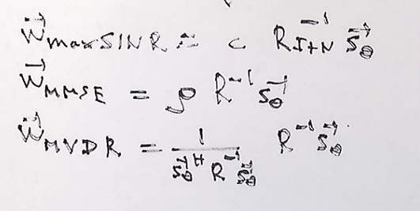

We noticed that hte portion of mmse and mvdr are similar and only difference in scale. 

# Maximum Likelihood Beamforming (Gaussian Assumption)

All previous beamformers make no assumption of r(t), the disturbance or the interference signal. Lets assume an antenna array with each signal received has components for interference and noise. Then have a beamformer "black box that can be either linear or non-lineaer.

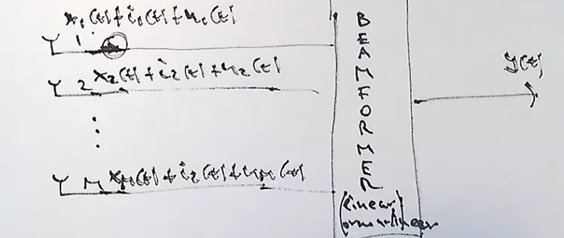

The signal of interest is x(t) , and that is the deterministic part of the recieved signal. The noise component n(t) can be considered as white gaussian noise WGN. the interference is then considered gaussian , with the autocorrelation matrix equal to R_I.

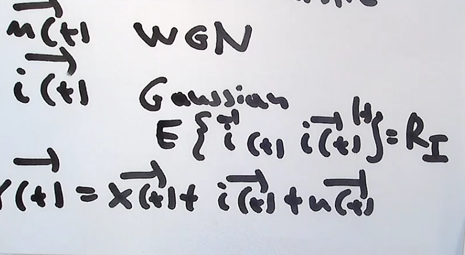
 
 The desired output of the system is the determinstic part of x(t) or better stated as d(t):

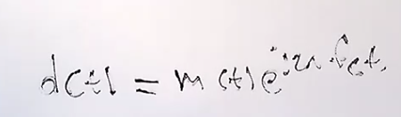

What is the statistical distribution of r(t)?
r(t) is gaussian because it is made up of gaussian components.

What is the expected r(t)? the expected is the deterministic copmoment x(t) plus the mean of hte interference and the mean of the of the noise. If the mean of the noise and interference is 0. the expected output of r(t) becomes the desired signal d(t)*s_theta

What is the covariance matrix of the recieved signal?

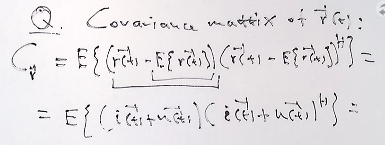

THe output of wich is R_I+N

the p.d.f of the r(t) is calculated using the following formula :

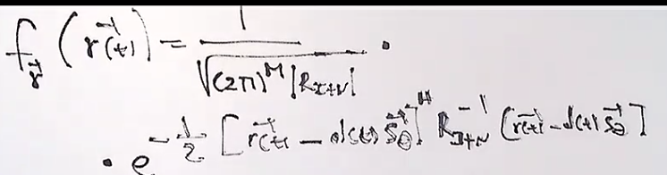

SOolution to find the maximum likelihood maxmization of hte desired vector d(t)^ . 

1. Write the f(r) (the pdf) and maximize with respect of the d(t). 
2. notice that you only need to maximize the exponential coponent of hte pdf.
3. set the derivative of the entire term to 0
4. note that this is a complex number so the derivative must be a d/d (d*(t))
5. note that the terms to the hermitian are conjugates

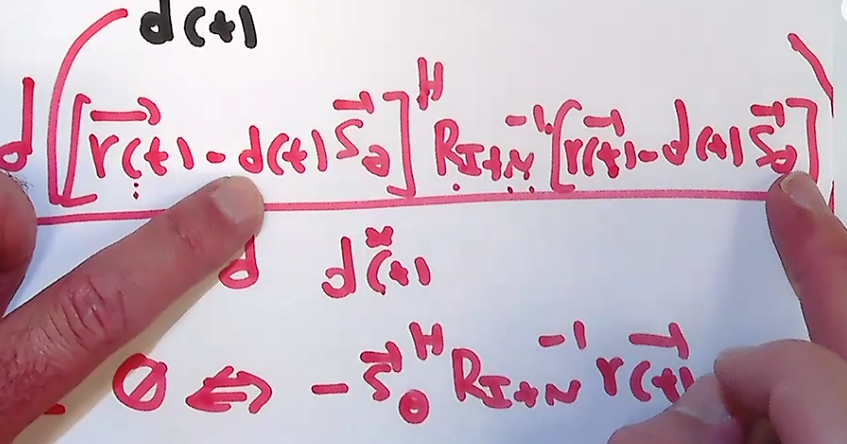

Finally we can solve for the desired signal and arrive at the following :

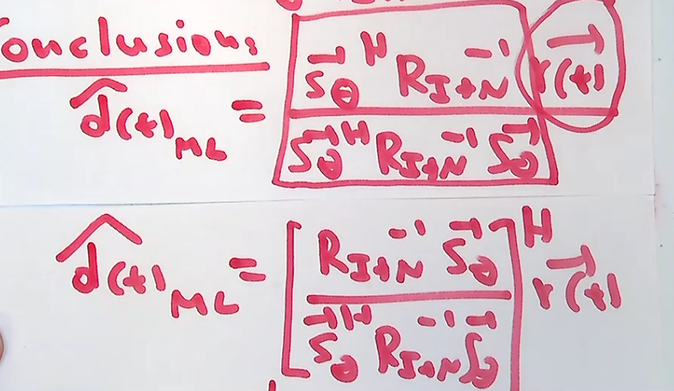

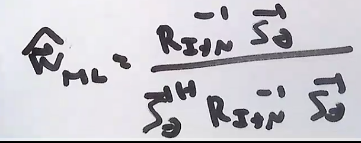

# Adaptive Beamforming

Unknown autocrelation matrix R

Collect array snapshots with sampling period T . we can have a data record of sampled points.Once you have those points you can calculate a R hat of n , from the received signal samples of r(t). This becomes an estimated R. 
This R(n)^ is the same as R. This is known as the unbiased estimator.

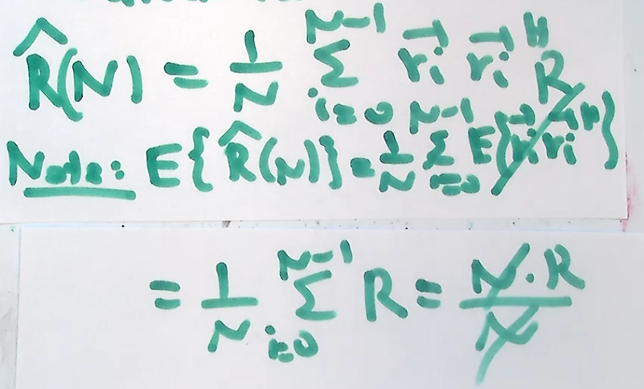

So since we did not know R we took samples of r(t) and we formed a sample average estimate with n samples. but we proved that in the mean or on the average we get R. so its generally ok to use this method on average. 

## Lets design an adaptive beamforer:
We can create a wieght vector based on the R(n)*s_theta
This is called the sample matrix inversion beamformer.

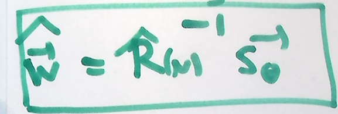

Note that we need N >= M for the R(n)^ to be invertible. 
so we need at least the same amount of samples as we have antennas in order to be able to inverse this matrix created from sampling  to be used as a sample matrix inversion beamformer.

The adaptive SMI weight vector can be written as :
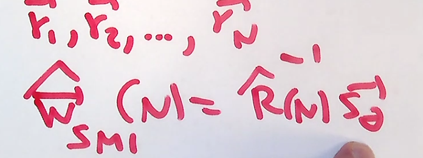

What happens when we get a new data point ? should we try to incorporate our new data into the generation of the autocorrelation matrix R(n)^. Do we keep all of the samples as we calcualte the R(n)^ ? We can find a way to create the next weight vector (n+1) with a function of the previous weight vector and the previous auto-correlation matrix of the recieved signals. 

## Recursive Sample-Averaging
Breaking up the formula into the previous R^ and the next R^ allows us to rewrite it with a forgetting factor beta that goes from 0-1 this allows us to reduce the amount of memory we keep inside the R^ matrix when creating our R^ sampled. 

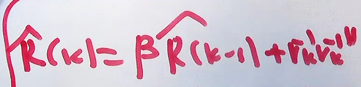

