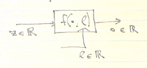

Completed : 
1. Optimal Ideal Beamformers
2. Adaptive SMI-Type Beamforming

New Chapter :
Adaptive Online Beamformers

Problem Statment 
An arbitrary system (linear or non-linear) . 

Find L0 (if it exists) that makes the average output of the system equal to zero.

## Robins -Monro '51
The stochastic approximation method
- If we have access to a sequence of system inputs z1,z2,z3...zn and it is an i.i.d (independtly distributed).

#LMS

Lms says that there is a way to rewrite the mmse as a recursive form. 

Leaky LMS:
