# Recap

## Linear Antenna Model

For the received signal model

r(t) =  x(t) + i(t) + n(t)

where x(t) is the determnistic signal made up of carrier signal at some angle theta. it has an expected magnitude of rho, it has an expected R(t) (autocorrelation matrix). An expected disturbance autocorrelation matrix R_I+N made up of the noise and interference expectation. and stheta , is the array response vector created from the antenna array model.

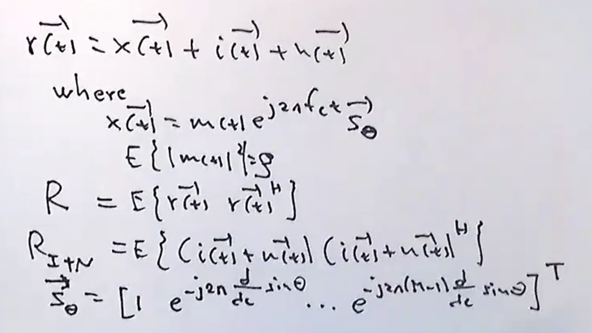

## Beamforming

From all of these statements in the model. we derive the following weight vectors for the model to provide certain performance improvements. 

The maximum SINR to improve signal to noise ratio. the mmse to minimize the error, and mvdr to minmize disturbance and ml to get the optimum desired signal.

we realized that all of these criterions are scaled versions of each other. 

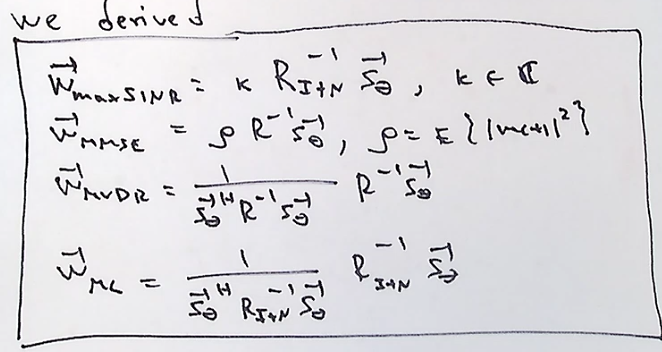

> In real life , R, R_i+n , or Stheta may not be known ...

So we must do our best to estimate the unknowns and then replace the estimates into our criterions. 

## Unbiased Estimator ^R

We considered the problem of creating an Estimator for R. 
So we created the statistical expectation of R with R^  . 
Given many samples of r we can create an estimate of R with samples that are averaged across N samples and generate a ^R(n) = (1/N) * sum(ri*ri^H,i=1 to i=N).

## Recursive Sample Averging 

This unbiased estimator requires the use of all n samples. but by creating a recursive sampling averaging function for ^R(n) we can use it to derive the criterion for any weight vector that will be adaptive . 

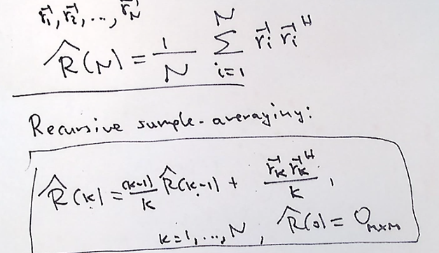

## Recursive Sample Averging with Forgetting Factor
This recursion keeps all data samples inside its calculated value. but we may need to "forget" some samples . So we must remove the growth of samples with a forgetting factor. from `0<b<1` , but it is usually close to 1. the memory of the algorithm is then defined as `1/(1-b)` . 

Ex: Say that b=0.95 then the memory =  (1/(1-0.95)) = 20 samples. So you would only pay attention to the last 20 samples.

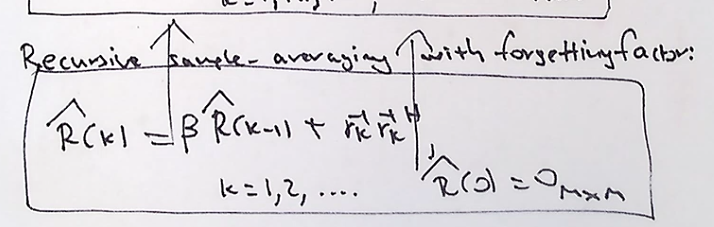

We an do the same thing to the input as we do for the disturbance matrix. 

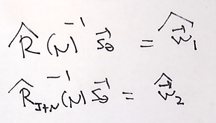

## Recursive Inversion 

Can we really use this recursive calculator without inversing it?. How do we create an estimator with Recursive Inversion. 

The only closed form formula that provides inverses of matrices. is the woodburry identity

### Woodbury Identity Lemma
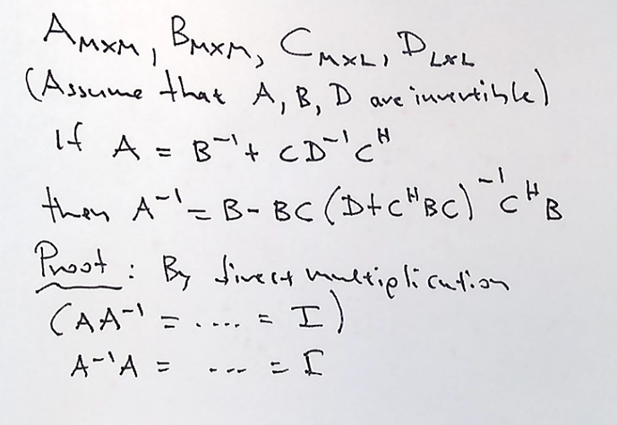

Given the recursive sampling estimator and the matrix inversion lemma lets find a recursive inversion. 
Lets set the matrix definitions. A is the ^R(k) and B^-1 is the previous ^R(k-1)*b , where b is th forgetting factor. Use rk vector as C , and D-1 as a scalar , 1. 

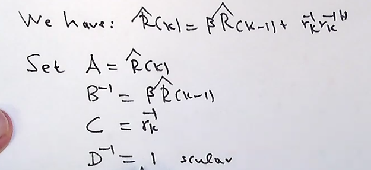

Lets us our woodbury identity to rewrite our definition and sove for ^R(k) inverse. 

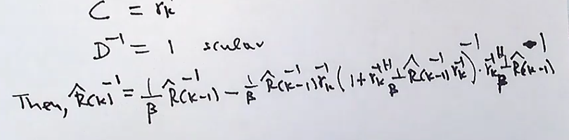

After manipulating and simplifying the equation we get a form for the matrix inverse equalling:

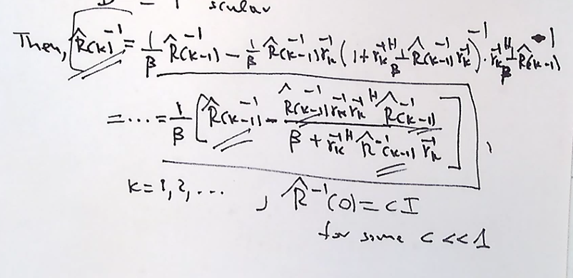

> Note: This is the foundation of the RLS algorithm. Recursive Least Squares. 

# Adaptive Beamforming

The ^R beam former is inspired by MMSE,MVDR criteria
and the ^R_I+N disturbance beam former comes from the MaxSINR and ML. If you had the information then these two would be scaled versions of each other. Since these are estimated then they are not scaled versions.

Signal Present beamforming, (#1) and signal absent beamformer (#2). 

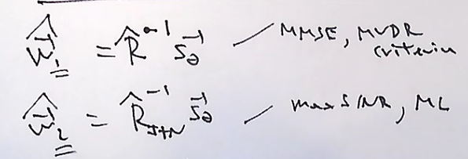

We analyze the SINR of each beam former. Equating the signal over the noise and interference we can derive the formula that provides the signal to interference-noise ratio given by random variables. The difference between the two random variables is that the beamformers are random variables and so are the SINR's . 

So when analyzing the SINR's how do we compare two random variables? We know the upper bound from an ideal beam former. So how do we find wich one is closer to the ideal?

The Maximum possible SINR from our previous notes (optimal):

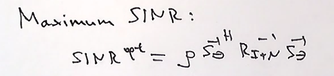

We can create a ratio of each SINR1 and SINR2 over the optimal and get ratio values of 0-1 for each . we can rewrite our expression in terms of alhpa 1 and alpha 2 as follows :

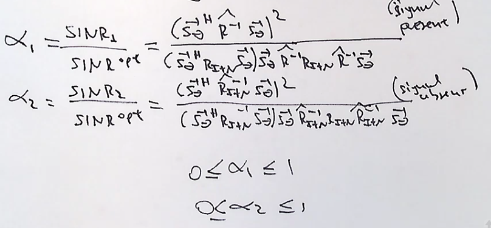

So our goal is to calculate the expected value of alhpa1 and alpha2 by getting the PDF of the random variables alpha1, and alpha2. 

So under the assumption tha the data r1,r2..rn ar gaussian and independent of each other and have a zero mean , then you can show that alpha2 is "incomplete beta distributed" if in addition (N> M-3)

An incomplete beta distributed means that the probability of a randomvariable is less than or equal to ssome value x , is equal to the expression :

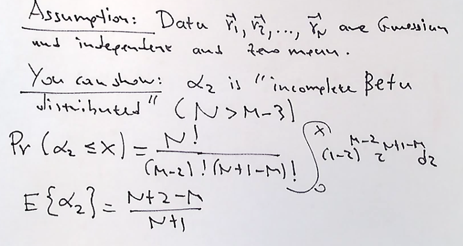

The expected value of the alpha2 is described using the "incomplete beta distributed" rule and the expected value as N gets large goes to 1. This makes sense since the more samples taken the more the expectation is like the ideal.

