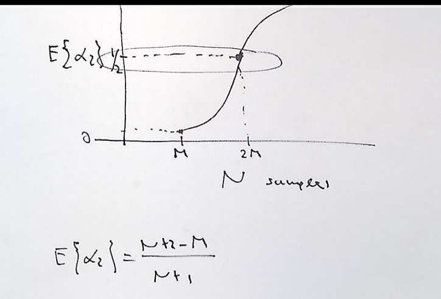
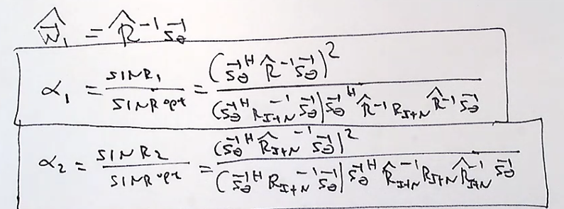
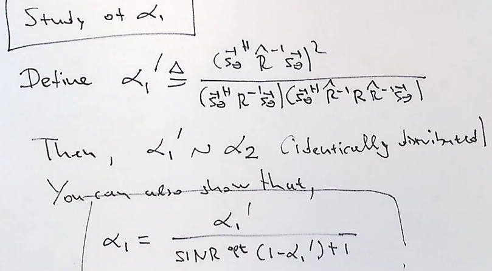
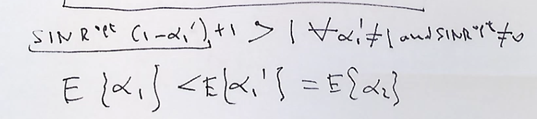
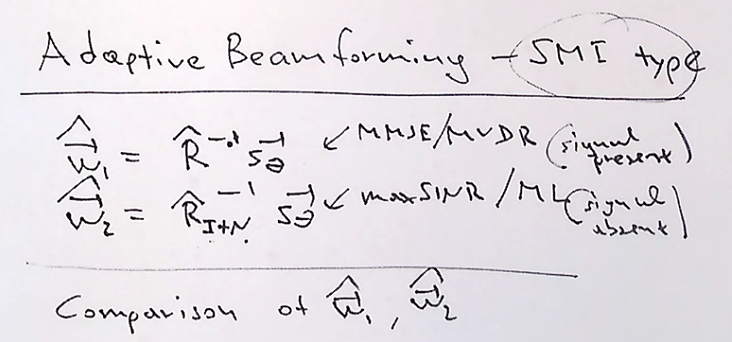
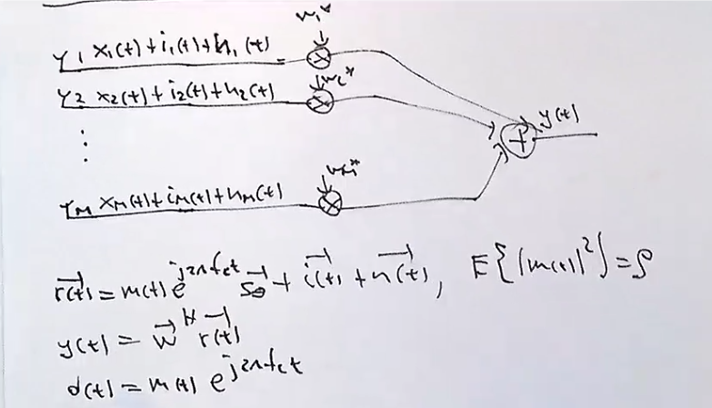
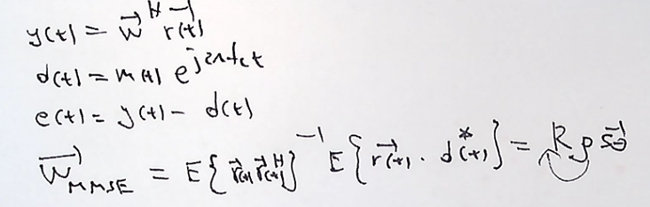
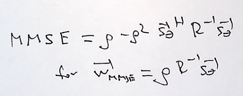
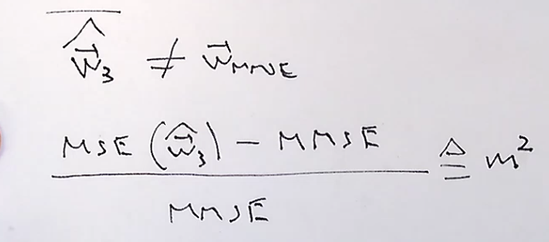
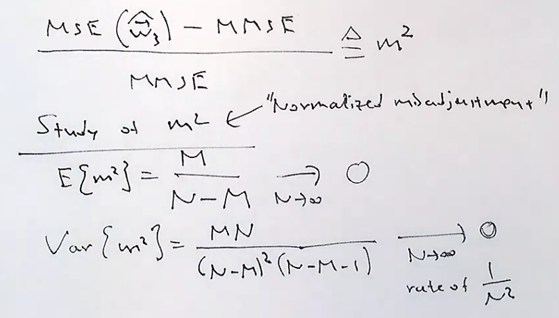

# Adaptive Beamforming - SMI type

Wich of the two beamformers is better? A beamformer with a signal present or signal absent.  We must compare with some criterion. So we can start with SINR. 

We start by normalizing SINR1 and SINR2 by the optimum SINR. The ratios alhpa1 and alpha2 are now a number between 0-1 . We can get the expected value of these random variables.we stated that alpha2, has a"incomplete-beta distributed" . So we can write the expression for the mean of alpha2. the mean is equal to ((N+2 - M)/ (N+1)) . So as N goes to infinity the expected value goes to 1. The variance of alpha2 ((N+2-M)(M-1)/(N+1)^2(N+2)) . when the samples go to infinity then the variance goes to 0 at a rate of (1/N^2). 

for a data record size N, twice as many as my amount of elements. for N=2M, the average SINR loss compared to the optimum value is 3dB (half)

So now we will analyze the other side of hte curve and look at alpha 1. we need to get the pdf of alpha1 like we did for alpha 2. Unfortunately we do not have a method to get the pdf of alpha1. 

## The study of alpha 1

So here we want to find a PDF of alpha1 just like we did for alpha2, we do not have a way to determine this because of the different matrices in the denominator of the alpha1 equation. So now we compare by simulation by experimentation.

Notice that the denominator is always going to be positive. The denominator is greater than 1 for every value of alhpa1 prime other than 1. and for sinropt other than 0. So for every alpha1 prime alhpa 1 is less than alpha 1 prime. 

and if athe expected distribution of alpha1 and alpha2 is the same than alpha1 is less than the alpha2 in the mean. 

This means that in the average the sinr performance is better without the signal . So if you could tell your transmitter to wait until you can collect enough samples 

It is better to estimate your autocorrelation matrix using the signal absent beamformer. because it has better SINR.

This solves the problem when you dont have access to the whole autocorelation matrix . but what happens when you dont have access to the theta. 

## Reveiw of the Ideal MMSE Beamformer

We are doing linear antenna processing. all weights come adjust the input signals. and then are summed to the y(t). the recieved signal has interference and noise. remember that the signal has some power 'rho' . We can deteremine a desired signal output d(t).

We will replace teh expectations with sampling 

The average samples allow for a supervised beamforming. so with a known pattern of input signals and desired signals the beamformer could then create an average .

Lets try to find a PDF for this beamfomer. we start by looking at the ideal mmse

We know that the beamformer is not ideal , so we compare the what it could be and we find a "normalized misadjustment", m^2. when we study this m^2 we can determine an expected value. 

Notice that in the man this goes to 0 as the samples increase . and the variance of this goes to 0 as N samples increase. 

